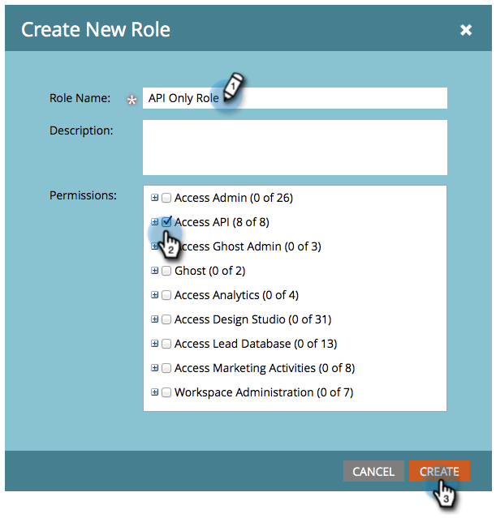

# Creare un ruolo utente solo per API {#create-an-api-only-user-role}

Se si desidera eseguire l&#39;integrazione con Marketo tramite [REST API](https://experienceleague.adobe.com/it/docs/marketo-developer/marketo/rest/rest-api), è consigliabile [assegnare a un utente il ruolo Solo API](/help/marketo/product-docs/administration/marketo-with-adobe-identity/add-api-only-user-for-adobe-ims-enabled-subscriptions.md) e quindi [creare un servizio personalizzato da utilizzare con REST API](/help/marketo/product-docs/administration/additional-integrations/create-a-custom-service-for-use-with-rest-api.md). Di seguito viene descritto come creare il ruolo utente Solo API.

>[!NOTE]
>
>**Autorizzazioni amministratore richieste**

1. Passa alla schermata **[!UICONTROL Admin]**.

   

1. Fai clic su **[!UICONTROL Users & Roles]**.

   

1. Fare clic sulla scheda **[!UICONTROL Roles]** e quindi su **[!UICONTROL New Role]**.

   

1. Immettere un nome di ruolo, selezionare le autorizzazioni di accesso API che si desidera assegnare e fare clic su **[!UICONTROL Create]**.

   

>[!TIP]
>
>È sempre consigliabile concedere solo le autorizzazioni minime necessarie.

>[!MORELIKETHIS]
>
>Ok, ben fatto! Ora [creiamo un utente solo API](/help/marketo/product-docs/administration/marketo-with-adobe-identity/add-api-only-user-for-adobe-ims-enabled-subscriptions.md).
