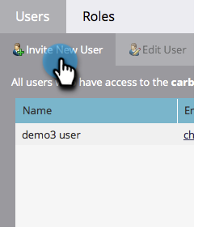

# Creare un utente solo API {#create-an-api-only-user}

Se desideri effettuare l’integrazione con Marketo tramite il [API REST](https://developers.marketo.com/documentation/rest/), dovrai creare un utente solo API. Ecco come.

>[!PREREQUISITES]
>
>[Creare un ruolo utente solo API](/help/marketo/product-docs/administration/users-and-roles/create-an-api-only-user-role.md)

>[!NOTE]
>
>**Autorizzazioni amministratore richieste**

1. Vai a **Amministratore** area.

   

1. Fai clic su **Utenti e ruoli**.

   

1. Fai clic su **Invita nuovo utente**.

   

1. Immetti un indirizzo e-mail, un nome e un cognome per l’utente solo dell’API. Fai clic su **Successivo**.

   

   >[!TIP]
   >
   >Aggiungi un motivo facoltativo o una data di scadenza dell’accesso. Le date di scadenza dell&#39;accesso sono molto utili per i dipendenti a breve termine.

1. Seleziona la **Solo API** e controlla il **Solo API** casella di controllo. Fai clic su **Successivo**.

   

1. Fai clic su **Invia**.

   

>[!NOTE]
>
>Il pop-up dice: &quot;Un invito non è richiesto solo per API&quot;, ma questo non significa che hai fatto qualcosa di sbagliato. Significa solo che creeremo il ruolo senza che sia necessario inviare un messaggio e-mail di invito.

Bene allora! Ora andiamo avanti e creiamo il servizio personalizzato.

>[!MORELIKETHIS]
>
>[Creare un servizio personalizzato da utilizzare con l’API ReST](/help/marketo/product-docs/administration/additional-integrations/create-a-custom-service-for-use-with-rest-api.md)
