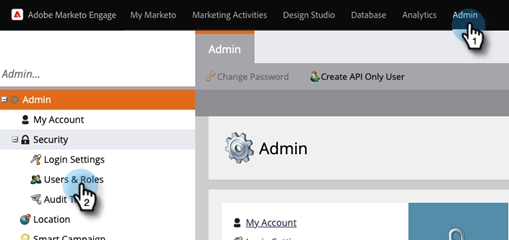
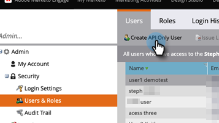

# Aggiungere utente solo per API per gli abbonamenti abilitati Adobe IMS {#add-api-only-user-for-adobe-ims-enabled-subscriptions}

Gli utenti e gli amministratori di Marketo Engage Marketing vengono gestiti in Adobe Admin Console, mentre gli utenti solo API di Marketo Engage devono essere creati e gestiti in Marketo Engage.

>[!NOTE]
>
>Solo API Gli utenti creati nell’interfaccia utente di Marketo Engage non vengono conteggiati nell’assegnazione degli utenti.

I passaggi seguenti descrivono come aggiungere un utente API Only in Marketo Engage. Prima di eseguire questa operazione, è necessario che [abbia stabilito un ruolo solo API](/help/marketo/product-docs/administration/users-and-roles/create-an-api-only-user-role.md).

1. In Marketo, fare clic su **[!UICONTROL Admin]** e selezionare **[!UICONTROL Users & Roles]**.

   

1. Fai clic su **[!UICONTROL Create API Only User]**.

   

1. Immettere [!UICONTROL Email], [!UICONTROL First Name] e [!UICONTROL Last Name] per l&#39;utente API. Selezionare il ruolo [!UICONTROL API Only] da assegnare all&#39;utente. Al termine, fai clic su **[!UICONTROL Create API Only User]**.

   

>[!NOTE]
>
>Quando l’azione ha esito positivo, la finestra modale Crea solo utente API si chiude e l’elenco Utenti si aggiorna e il nuovo utente è visibile.
