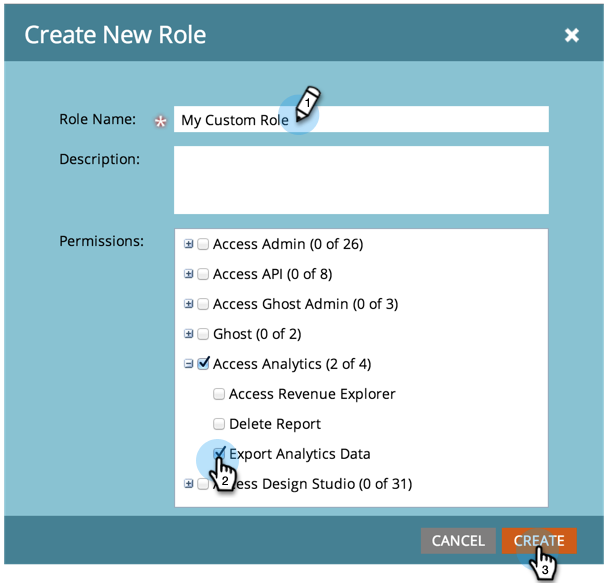

# Creare, eliminare, modificare e modificare un ruolo utente {#create-delete-edit-and-change-a-user-role}

**** Rolesgroup riunisce una serie di autorizzazioni. **Le** autorizzazioni consentono di fare delle cose a Marketo. È possibile assegnare un **ruolo** a un utente. Facile come una torta.

>[!NOTE]
>
>**Autorizzazioni amministratore richieste**

## Creare un ruolo {#create-a-role}

1. Vai a **Admin **e fai clic su **Utenti e ruoli**.

   

1. Passate alla scheda** Ruoli** e fate clic su **Nuovo ruolo**.

   

1. Assegnate un nome al nuovo ruolo, verificate tutte le autorizzazioni che desiderate concedere agli utenti associati al ruolo e fate clic su **Crea**.

   

## Eliminare un ruolo {#delete-a-role}

1. In Amministratore,** **fare clic su **Utenti e ruoli**.

   

1. Nella scheda **Ruoli **selezionare un ruolo e fare clic su **Elimina ruolo**.

   

1. Confermare l&#39;eliminazione facendo clic su **Elimina**.

   

>[!NOTE]
>
>È innanzitutto necessario assicurarsi che nessun utente sia assegnato a un ruolo, altrimenti non può essere eliminato.

## Modifica di un ruolo esistente {#edit-an-existing-role}

>[!NOTE]
>
>Per modificare il tuo ruolo utente, dovrai effettuare l’accesso come un altro utente con diritti di amministratore.

1. Accedete a **Admin** e fate clic su **Utenti e ruoli**.

   

1. Fare clic sulla scheda **Ruoli **.

   

1. Selezionate il ruolo da modificare e fate clic su** Modifica ruolo**.

   

1. Apportate tutte le modifiche necessarie e fate clic su **Salva**.

   

   >[!NOTE]
   >
   >Le modifiche apportate al ruolo interesseranno tutti gli utenti associati a tale ruolo.

   >[!TIP]
   >
   >Volete aggiornare l&#39;indirizzo e-mail dell&#39;account? [Scopri come](http://docs.marketo.com/x/3wFI).

## Modifica del ruolo di un utente {#change-a-users-role}

1. Accedete a **Admin** e fate clic su **Utenti e ruoli**.

   

1. Selezionare l&#39;utente a cui si desidera assegnare un ruolo diverso e fare clic su **Modifica utente.**

   

1. Deselezionare il ruolo precedente, selezionarne uno nuovo, quindi fare clic su **Salva**.

   

>[!NOTE]
>
>Se lasciate selezionati più ruoli, per impostazione predefinita Marketo utilizza le autorizzazioni più restrittive.

Impressionante, ora sei davvero su un rotolo!  (Capito?)