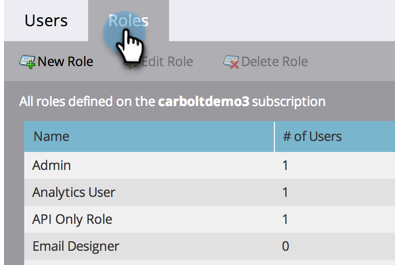

# Creare, eliminare, modificare e modificare un ruolo utente {#create-delete-edit-and-change-a-user-role}

**Ruoli** raggruppa un gruppo di autorizzazioni. **Autorizzazioni** consente di eseguire operazioni in Marketo. Assegna un **ruolo** a un utente. Facile come una torta.

>[!NOTE]
>
>**Autorizzazioni amministratore richieste**

>[!IMPORTANT]
>
>I seguenti ruoli sono ruoli di sistema e non possono essere modificati o eliminati:
>
>* Amministratore
>* Amministratore prodotto Adobe
>* Utente standard
>* Editor RTP
>* Utilità di avvio RTP

## Crea un Ruolo {#create-a-role}

1. Vai a **[!UICONTROL Amministratore]** area.

   

1. Clic **[!UICONTROL Utenti e ruoli]**.

   

1. Vai a **[!UICONTROL Ruoli]** e fai clic su **[!UICONTROL Crea Ruolo]**.

   

1. Assegna un nome al nuovo ruolo, controlla tutte le autorizzazioni che desideri concedere agli utenti associati al ruolo e fai clic su **[!UICONTROL Crea]**.

   

## Eliminare un ruolo {#delete-a-role}

1. Vai a **[!UICONTROL Amministratore]** area.

   

1. Clic **[!UICONTROL Utenti e ruoli]**.

   

1. Sotto **[!UICONTROL Ruoli]** , selezionare un ruolo e fare clic su **[!UICONTROL Elimina Ruolo]**.

   

1. Conferma l’eliminazione facendo clic su **[!UICONTROL Elimina]**.

   

>[!NOTE]
>
>Devi innanzitutto assicurarti che nessun utente sia assegnato a un ruolo, altrimenti non potrà essere eliminato.

## Modifica un ruolo esistente {#edit-an-existing-role}

>[!NOTE]
>
>Per modificare il tuo ruolo utente, dovrai accedere come altro utente con diritti di amministratore.

1. Vai a **[!UICONTROL Amministratore]** area.

   

1. Clic **[!UICONTROL Utenti e ruoli]**.

   

1. Fai clic su **[!UICONTROL Ruoli]** scheda.

   

1. Seleziona il ruolo da modificare e fai clic su **[!UICONTROL Modifica Ruolo]**.

   

1. Apporta tutte le modifiche necessarie e fai clic su **[!UICONTROL Salva]**.

   

   >[!NOTE]
   >
   >Le modifiche apportate al ruolo avranno effetto su tutti gli utenti associati a questo ruolo.

   >[!TIP]
   >
   >Desideri aggiornare l’indirizzo e-mail dell’account? [Scopri come](/help/marketo/product-docs/administration/settings/edit-account-settings.md).

## Cambia il ruolo di un utente {#change-a-users-role}

1. Vai a **[!UICONTROL Amministratore]** area.

   

1. Clic **[!UICONTROL Utenti e ruoli]**.

   

1. Seleziona l’utente a cui assegnare un ruolo diverso e fai clic su **[!UICONTROL Modifica utente]**.

   

1. Deseleziona il ruolo precedente, seleziona quello nuovo, quindi fai clic su **[!UICONTROL Salva]**.

   

>[!NOTE]
>
>Se lasci selezionati più ruoli, per impostazione predefinita Marketo utilizzerà l’autorizzazione più restrittiva.
