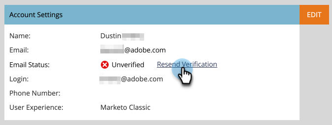
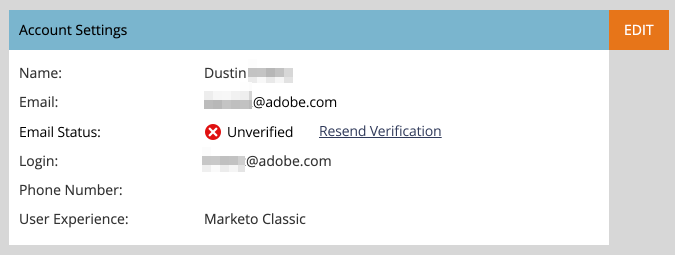

# Verifica e-mail {#email-verification}

Gli abbonamenti Adobe Marketo Engage richiedono a tutti gli utenti non API, inclusi gli amministratori di Marketo Engage, di verificare il proprio indirizzo e-mail.

## Perché è stata introdotta questa funzione {#why-this-feature-was-introduced}

Il Marketo Engage sta continuando il rollout di Verifica e-mail in preparazione alla migrazione dei clienti alla piattaforma aziendale Adobe, inclusa la migrazione degli utenti agli ID Adobe. Questa funzione migliora la sicurezza degli account utente di Marketo Engage esistenti. Per garantire che un utente del Marketo Engage sia associato all’Adobe ID corretto, gli utenti del Marketo Engage esistenti devono verificare il proprio indirizzo e-mail. Per eseguire la migrazione a un’Adobe ID, l’utente del Marketo Engage deve disporre di un indirizzo e-mail verificato. Se un utente del Marketo Engage non verifica il proprio indirizzo e-mail, non può effettuare la migrazione a un Adobe ID e perderà l’accesso a un abbonamento Marketo al termine della migrazione utente per l’abbonamento.

## Invito utente {#user-invite}

Quando un amministratore invita un utente, quest’ultimo viene verificato automaticamente dopo aver fatto clic sul collegamento di invito.

>[!IMPORTANT]
>
>L&#39;eccezione a quanto sopra è _in una sottoscrizione di sola SSO_, gli amministratori riceveranno un nuovo invito utente, ma gli utenti non amministratori non lo riceveranno. Gli utenti che non sono amministratori devono comunque seguire il processo di verifica e-mail per garantire la migrazione dei propri record. Gli utenti possono inviarsi il collegamento di verifica tramite e-mail facendo clic sull&#39;icona &quot;Il mio profilo&quot; e passando a **Il mio account** > **Impostazioni account** > **Invia di nuovo la verifica**.

## E-mail di verifica {#verification-email}

Gli utenti riceveranno l’e-mail seguente quando la verifica e-mail viene attivata per un abbonamento o se è attivata da un amministratore/utente.

Per il completamento della verifica e-mail è necessaria una sessione utente attiva. L’utente deve prima accedere alla sottoscrizione Marketo utilizzando il proprio URL del provider di identità (IdP). Una volta stabilita la sessione, _quindi_ fai clic sul collegamento **Verifica indirizzo e-mail** nell&#39;e-mail.

>[!TIP]
>
>Per inviare di nuovo un&#39;e-mail di verifica a un utente non verificato, selezionarne il record e fare clic sul pulsante **[!UICONTROL Verifica e-mail]**.

## Modifica di un indirizzo e-mail {#changing-an-email-address}

Quando l’indirizzo e-mail di un utente viene modificato, non viene verificato. Verrà inviata loro un’e-mail che consentirà di eseguire nuovamente la verifica. Gli utenti possono inviare di nuovo manualmente l&#39;e-mail facendo clic su **[!UICONTROL Invia di nuovo verifica]**.

## Utenti e ruoli {#users-and-roles}

In **[!UICONTROL Amministratore]** > **[!UICONTROL Utenti e ruoli]**, la colonna Stato e-mail mostra lo stato di verifica di ogni utente.

## ID di accesso per più utenti {#multiple-user-login-ids}

A un singolo indirizzo e-mail può essere associato un solo account utente. Se a un singolo indirizzo e-mail sono associati più account utente, il Marketo Engage richiederà la risoluzione del conflitto e la visualizzazione di tutti gli accessi utente associati all&#39;indirizzo e-mail, oltre a tre opzioni di risoluzione:

* Utilizza l&#39;e-mail corrente per l&#39;ID accesso utente corrente
* Utilizza una nuova e-mail per l&#39;ID di accesso utente corrente
* Posticipa la decisione al prossimo accesso

  

>[!NOTE]
>
>Un account utente deve essere associato a un singolo indirizzo, ma può essere utilizzato in più abbonamenti tramite Universal ID.
