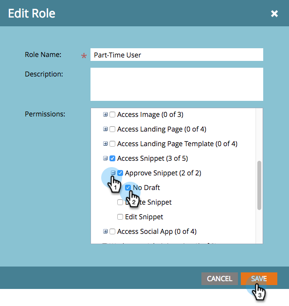

# Abilita bozza senza testo per snippet {#enable-no-draft-for-snippets}

La funzione Nessuna bozza per snippet consente di distribuire le modifiche apportate ai frammenti senza dover creare le risorse approvate. Tutte le risorse che utilizzano lo snippet modificato ricevono gli aggiornamenti e mantengono i rispettivi stati:

* Le risorse approvate ottengono gli aggiornamenti dei frammenti e rimangono approvate

* Le bozze ottengono gli aggiornamenti dei frammenti e rimangono in modalità bozza

No-Draft viene abilitato automaticamente per tutti i ruoli di amministratore. Un amministratore può quindi abilitare questa funzione per qualsiasi ruolo aggiuntivo.

>[!NOTE]
>
>**Autorizzazioni amministratore richieste**

1. Vai a **Amministratore** area.

   

1. Clic **Utenti e ruoli**.

   

1. Vai a **Ruoli** , selezionare un ruolo, quindi fare clic su **Modifica Ruolo**.

   

1. Espandi **Accedere a Design Studio** opzione.

   

1. Espandi **Snippet di accesso** opzione.

   

1. Espandi **Approva snippet** e controlla **Nessuna bozza** casella. Quindi fai clic su **Salva**.

   

>[!TIP]
>
>Per disattivare l&#39;opzione Nessuna bozza (No-Draft), effettuate le operazioni descritte ai punti 1-4 precedenti, deselezionate la casella di controllo Nessuna bozza (No-Draft) e fate clic su **Salva**.

>[!MORELIKETHIS]
>
>[Approvare un frammento senza bozza](/help/marketo/product-docs/personalization/segmentation-and-snippets/snippets/approve-a-snippet-with-no-draft.md)
