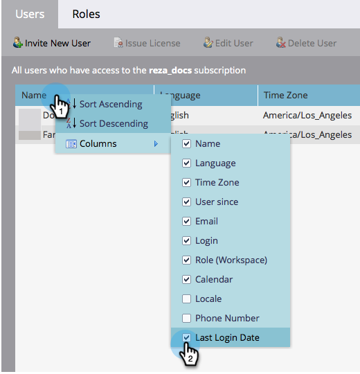

# Esportare un elenco di utenti e ruoli {#export-a-list-of-users-and-roles}

>[!NOTE]
>
>**Autorizzazioni amministratore richieste**

È abbastanza facile esportare un elenco completo dei tuoi utenti e ruoli utente. Ecco come.

1. Vai a **Amministratore**.

   

1. Fai clic su **Utenti e ruoli**.

   

1. Aggiungi/rimuovi le colonne desiderate prima dell’esportazione.

   >[!TIP]
   >
   >Per esportare i ruoli, vai alla pagina **Ruoli** prima scheda, quindi esporta.

   

1. Fai clic sul pulsante **Esporta** icona.

   

   E questo è tutto, gente! È necessario scaricare il nuovo file Excel.

   
