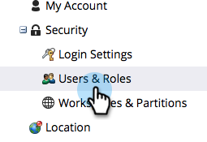

# Esportare un elenco di utenti e ruoli {#export-a-list-of-users-and-roles}

>[!NOTE]
>
>**Autorizzazioni amministratore richieste**

Per esportare un elenco completo di utenti e ruoli utente, segui la procedura riportata di seguito.

1. Passa a **[!UICONTROL Admin]**.

   

1. Fai clic su **[!UICONTROL Users & Roles]**.

   

1. Aggiungere o rimuovere le colonne desiderate prima dell&#39;esportazione.

   >[!TIP]
   >
   >Per esportare i ruoli, passare prima alla scheda **[!UICONTROL Roles]**, quindi eseguire l&#39;esportazione.

   

1. Fare clic sull&#39;icona **[!UICONTROL Export]**.

   

   Inizia il download del file Excel.

   
