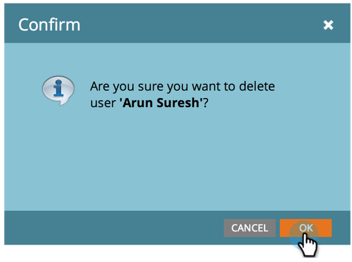
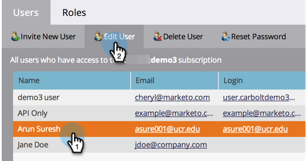

# Gestire gli utenti di Marketo {#managing-marketo-users}

>[!IMPORTANT]
>
>Questo articolo è destinato solo a coloro che utilizzano _not_ [Marketo con Adobe Identity](/help/marketo/product-docs/administration/marketo-with-adobe-identity/adobe-identity-management-overview.md){target="_blank"}. In caso contrario, segui i passaggi descritti in [questo articolo](/help/marketo/product-docs/administration/marketo-with-adobe-identity/add-or-remove-a-user.md){target="_blank"}.

## Crea utenti {#create-users}

1. Passa alla schermata **[!UICONTROL Admin]**.

   

1. Fai clic su **[!UICONTROL Users & Roles]**.

   

1. Fai clic su **[!UICONTROL Invite New User]**.

   

1. Immettere **[!UICONTROL Email]**, **[!UICONTROL First Name]** e **[!UICONTROL Last Name]**.

   

1. Se necessario, immettere un motivo per l&#39;invito e selezionare una data di scadenza nel campo **[!UICONTROL Access Expires]** utilizzando il selettore data.

   

1. Fai clic su **[!UICONTROL Next]**.

   

   >[!TIP]
   >
   >Una data di scadenza è ideale per le parti interessate esterne a breve termine o per i consulenti che necessitano dell’accesso a Marketo solo per un breve periodo di tempo.

   >[!NOTE]
   >
   >Quando arriva la data di scadenza, l’utente riceve una notifica di scadenza e il suo account è bloccato.

1. Selezionare **[!UICONTROL Role]** e fare clic su **[!UICONTROL Next]**.

   

1. Se necessario, apportare modifiche al messaggio di invito. Fai clic su **Send**.

   

   >[!NOTE]
   >
   >L’e-mail/accesso deve essere univoco; se l’hai già utilizzato in un’istanza sandbox, dovrai utilizzarne uno diverso in produzione e viceversa.

   

   >[!NOTE]
   >
   >Gli inviti scadono tre giorni dopo l&#39;aggiunta di un nuovo utente.

Il nuovo utente è ora elencato nella scheda Utenti e riceverà un’e-mail con le istruzioni su come attivare il proprio account.

## Elimina utenti {#delete-users}

>[!NOTE]
>
>Se l&#39;utente che si desidera eliminare è anche un utente di Dynamic Chat, è necessario [rimuoverlo da Dynamic Chat](/help/marketo/product-docs/demand-generation/dynamic-chat/setup-and-configuration/add-or-remove-chat-users.md#remove-a-chat-user){target="_blank"} in Admin Console prima di eliminarlo in Marketo Engage.

1. Passa alla schermata **[!UICONTROL Admin]**.

   

1. Fai clic su **[!UICONTROL Users & Roles]**.

   

1. Selezionare l&#39;utente da rimuovere e fare clic su **[!UICONTROL Delete User]**.

   

1. Confermare facendo clic su **[!UICONTROL OK]**.

   

## Reimposta password utente {#reset-user-passwords}

1. Passa alla schermata **[!UICONTROL Admin]**.

   

1. Fai clic su **[!UICONTROL Users & Roles]**.

   

1. Selezionare un utente e fare clic su **[!UICONTROL Reset Password]**.

   

1. Fare clic su **[!UICONTROL Close]** per ignorare il prompt.

   

L’utente riceverà un’e-mail con le istruzioni per la reimpostazione della password.

>[!TIP]
>
>Se l’utente non vede l’e-mail nella propria casella in entrata, chiedi di controllare la propria cartella di posta indesiderata.

## Modificare le autorizzazioni e modificare le informazioni utente {#change-permissions-and-edit-user-information}

1. Passa alla schermata **[!UICONTROL Admin]**.

   

1. Fai clic su **[!UICONTROL Users & Roles]**.

   

1. Selezionare un utente e fare clic su **[!UICONTROL Edit User]**.

   

1. Puoi modificare le informazioni utente e il ruolo associato. Fai clic su **[!UICONTROL Save]**.

   

>[!CAUTION]
>
>Se sei l’unico amministratore in Marketo, non rimuovere i tuoi diritti di amministratore.

>[!NOTE]
>
>Se un nuovo utente viene invitato come amministratore o se un amministratore viene eliminato, tutti gli amministratori correnti riceveranno una notifica e-mail.

Ottimo lavoro! Ora sai come creare un utente, eliminarne uno, reimpostarne la password e modificarne l’utente.
