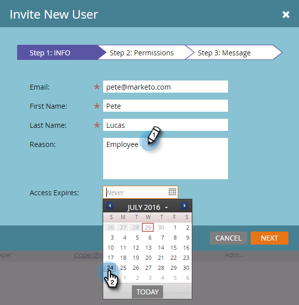

# Gestione degli utenti Marketo {#managing-marketo-users}

## Creare utenti {#create-users}

1. Vai a **Amministratore** area.

   

1. Fai clic su **Utenti e ruoli**.

   

1. Fai clic su **Invita nuovo utente**.

   

1. Inserisci il **Indirizzo e-mail**, **Nome** e **Cognome**.

   

1. Facoltativamente, immetti un motivo per l’invito e seleziona una data di scadenza nel **Scadenza accesso** utilizzando il selettore data.

   

1. Fai clic su **Successivo**.

   

   >[!TIP]
   >
   >Una data di scadenza è ottima per i soggetti esterni o i consulenti a breve termine che necessitano di accesso Marketo solo per un breve periodo di tempo.

   >[!NOTE]
   >
   >Quando arriva la data di scadenza, l’utente riceve una notifica di scadenza e il suo account è bloccato.

1. Seleziona la **Ruolo** di tua scelta e fai clic su **Successivo**.

   

1. Apporta le modifiche necessarie al messaggio di invito. Fai clic su **Invia**.

   

   >[!NOTE]
   >
   >L’e-mail/accesso deve essere univoco; se lo hai già utilizzato in un’istanza sandbox, dovrai utilizzarne una diversa in produzione e viceversa.

   

   >[!NOTE]
   >
   >Gli inviti scadono tre giorni dopo l’aggiunta di un nuovo utente.

Il nuovo utente è ora elencato nella scheda Utenti e riceverà un messaggio e-mail con istruzioni su come attivare il proprio account.

## Elimina utenti {#delete-users}

1. Vai a **Amministratore** area.

   

1. Fai clic su **Utenti e ruoli**.

   

1. Seleziona l’utente da rimuovere e fai clic su **Elimina utente**.

   

1. Conferma facendo clic su **OK**.

   

## Reimposta password utente {#reset-user-passwords}

1. Vai all&#39;area Amministratore.

   

1. Fai clic su **Utenti e ruoli**.

   

1. Seleziona un utente e fai clic su **Ripristina password**.

   

1. Fai clic su **Chiudi** per ignorare il prompt.

   

L’utente riceverà un’e-mail con le istruzioni per la reimpostazione della password.

>[!TIP]
>
>Se l’utente non visualizza l’e-mail nella propria casella in entrata, chiedi loro di controllare la cartella della posta indesiderata/spam.

## Modificare le autorizzazioni e modificare le informazioni utente {#change-permissions-and-edit-user-information}

1. Vai a **Amministratore** area.

   

1. Fai clic su **Utenti e ruoli**.

   

1. Seleziona un utente e fai clic su **Modifica utente**.

   

1. È possibile modificare le informazioni utente e modificare il ruolo associato. Fai clic su **Salva**.

   

>[!CAUTION]
>
>Se sei l’unico amministratore in Marketo, assicurati di non rimuovere i tuoi diritti di amministratore.

>[!NOTE]
>
>Se un nuovo utente viene invitato come amministratore o se un amministratore viene eliminato, tutti gli amministratori correnti riceveranno una notifica e-mail.

Lavoro fantastico! Ora sai come creare un utente, eliminare un utente, reimpostare la password di un utente e modificare gli utenti.
