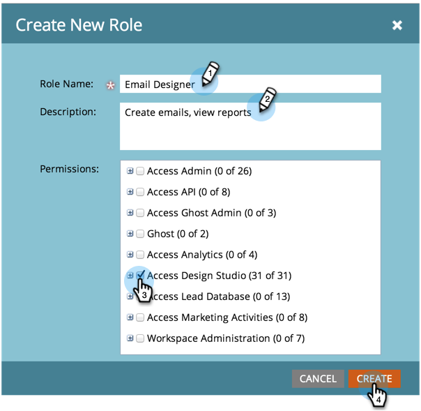

# Gestione di ruoli e autorizzazioni utente {#managing-user-roles-and-permissions}

Imposta, crea e modifica i ruoli utente e assegnali agli utenti. Questo consente di controllare le aree e le funzionalità a cui ogni utente Marketo ha accesso.

Ad esempio, un utente di marketing in genere ha bisogno di un accesso ampio all’interno dell’applicazione per creare, modificare e distribuire e-mail, pagine di destinazione e programmi. Un web designer, invece, trascorre quasi tutto il tempo in Design Studio, creando risorse da utilizzare nelle e-mail e nelle pagine di destinazione. E mentre i leader aziendali utilizzano ampiamente i rapporti di Marketo nell’area di Analytics, potrebbero non dover creare o guidare direttamente le risorse o i programmi.

>[!NOTE]
>
>**Autorizzazioni amministratore richieste**

Marketo fornisce diversi ruoli incorporati, con diversi livelli di accesso:

* **Amministratore** : tutte le parti dell’applicazione, inclusa la sezione Amministratore
* **Utente standard** : tutte le parti dell&#39;applicazione, eccetto la sezione Amministratore
* **Marketing User** : tutte le parti dell&#39;applicazione, eccetto la sezione Admin
* **Web Designer** : solo Design Studio
* **Utente di Analytics** : solo la sezione Analytics

Non puoi modificare i ruoli Amministratore e Utente standard, ma puoi modificarli. Puoi anche creare nuovi ruoli personalizzati per adattarli alle strutture organizzative specifiche della tua azienda.

## Assegnare ruoli a un utente {#assign-roles-to-a-user}

Puoi assegnare ruoli a un utente quando [crei utenti per la prima volta](/help/marketo/product-docs/administration/users-and-roles/create-delete-edit-and-change-a-user-role.md) o modificando un utente esistente](/help/marketo/product-docs/administration/users-and-roles/managing-marketo-users.md).[

1. Per modificare un utente esistente, vai su **Amministratore** e fai clic su **Utenti e ruoli**.

   

1. Dall&#39;elenco, seleziona l&#39;utente da modificare e fai clic su **Modifica utente**.

   

1. In **Ruoli**, selezionare i ruoli che si desidera assegnare all&#39;utente in base alle autorizzazioni necessarie e fare clic su **Salva**.

   

   >[!NOTE]
   >
   >Per informazioni su ciascun ruolo, consulta [Descrizioni delle autorizzazioni per i ruoli](/help/marketo/product-docs/administration/users-and-roles/managing-user-roles-and-permissions/descriptions-of-role-permissions.md).

## Creare un nuovo ruolo {#create-a-new-role}

A volte, la tua organizzazione dispone di dipendenti con ruoli molto specifici che richiedono una combinazione personalizzata di autorizzazioni.

1. Per creare un nuovo ruolo utente, vai ad Amministratore e fai clic su **Utenti e ruoli**.

   

1. Fare clic sulla scheda **Ruoli**.

   

1. Fare clic su **Nuovo ruolo**.

   

1. Immetti un **Nome ruolo**, una **Descrizione** (facoltativo) e seleziona le autorizzazioni necessarie agli utenti di questo ruolo.

   

## Modificare un ruolo {#edit-a-role}

Se devi modificare le autorizzazioni associate a un ruolo esistente, puoi modificare il ruolo.

1. Vai a **Amministratore** e fai clic su **Utenti e ruoli**.

   

1. Fare clic sulla scheda **Ruoli**.

   

1. Dall&#39;elenco, seleziona il ruolo da modificare e fai clic su **Modifica ruolo**.

   

1. Se necessario, modifica **Nome ruolo** e **Descrizione** e quindi modifica la selezione delle **Autorizzazioni** associate.

   

   >[!NOTE]
   >
   >Gli utenti con il ruolo modificato riceveranno le autorizzazioni modificate dopo la disconnessione e il nuovo accesso.

## Eliminare un ruolo {#delete-a-role}

Se un ruolo non è necessario, è possibile eliminarlo.

1. Vai ad Amministratore e fai clic su **Utenti e ruoli**.

   

1. Fare clic sulla scheda **Ruoli**.

   

1. Dall’elenco, seleziona il ruolo da eliminare e fai clic su **Elimina ruolo**.

   

1. Fai clic su **Elimina** per confermare.

   
