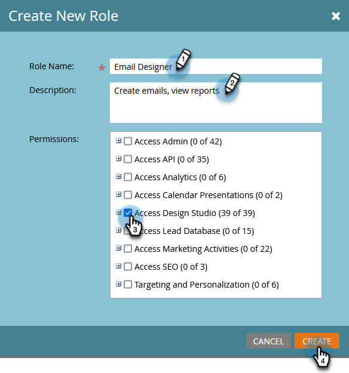

# Gestione di ruoli utente e autorizzazioni {#managing-user-roles-and-permissions}

Imposta, crea e modifica i ruoli utente e assegnali agli utenti. Questo consente di controllare le aree e le funzionalità a cui ogni utente di Marketo ha accesso.

Ad esempio, un utente marketing in genere ha bisogno di un ampio accesso in tutta l’applicazione per creare, modificare e distribuire e-mail, pagine di destinazione e programmi. Un web designer, invece, trascorre quasi tutto il suo tempo in Design Studio, creando risorse da utilizzare nelle e-mail e nelle pagine di destinazione. Inoltre, anche se i leader aziendali fanno ampio uso dei rapporti di Marketo nell’area di Analytics, potrebbero non dover creare o gestire direttamente le risorse o i programmi.

>[!NOTE]
>
>**Autorizzazioni amministratore richieste**

Marketo fornisce diversi ruoli incorporati, con diversi livelli di accesso:

* **Amministratore** - tutte le parti dell&#39;applicazione, inclusa la sezione Admin
* **Utente standard** - tutte le parti dell&#39;applicazione, ad eccezione della sezione Admin
* **Utente marketing** - tutte le parti dell&#39;applicazione, ad eccezione della sezione Admin
* **Designer web** - solo Design Studio
* **Utente di Analytics** : solo la sezione Analytics

Non puoi modificare i ruoli Amministratore e Utente standard, ma puoi modificare gli altri. Puoi anche creare nuovi ruoli personalizzati che corrispondano alle specifiche strutture organizzative della tua azienda.

## Marketo con identità Adobe {#marketo-with-adobe-identity}

Se utilizzi Marketo con Adobe Identity, l’elenco delle descrizioni del profilo [si trova qui](/help/marketo/product-docs/administration/marketo-with-adobe-identity/adobe-identity-management-overview.md#profile-levels).

## Assegnare ruoli a un utente {#assign-roles-to-a-user}

È possibile assegnare ruoli a un utente quando [creare gli utenti per la prima volta](/help/marketo/product-docs/administration/users-and-roles/create-delete-edit-and-change-a-user-role.md) o da [modifica di un utente esistente](/help/marketo/product-docs/administration/users-and-roles/managing-marketo-users.md).

1. Vai a **[!UICONTROL Amministratore]** area.

   

1. Clic **[!UICONTROL Utenti e ruoli]**.

   

1. Dall’elenco, seleziona l’utente da modificare e fai clic su **[!UICONTROL Modifica utente]**.

   

1. Sotto **[!UICONTROL Ruoli]**, seleziona i ruoli da assegnare all’utente in base alle autorizzazioni necessarie e fai clic su **[!UICONTROL Salva]**.

   

   >[!NOTE]
   >
   >Per informazioni su ciascun ruolo, consulta [Descrizioni delle autorizzazioni per il ruolo](/help/marketo/product-docs/administration/users-and-roles/descriptions-of-role-permissions.md).

## Crea un nuovo ruolo {#create-a-new-role}

Talvolta all’interno dell’organizzazione sono presenti dipendenti con ruoli molto specifici che richiedono una combinazione personalizzata di autorizzazioni.

1. Vai a **[!UICONTROL Amministratore]** area.

   

1. Clic **[!UICONTROL Utenti e ruoli]**.

   

1. Fai clic su **[!UICONTROL Ruoli]** scheda.

   

1. Clic **[!UICONTROL Crea Ruolo]**.

   

1. Immetti un **[!UICONTROL Nome Ruolo]**, a **[!UICONTROL Descrizione]** (facoltativo) e seleziona le autorizzazioni necessarie agli utenti di questo ruolo.

   

## Modifica un Ruolo {#edit-a-role}

Se è necessario modificare le autorizzazioni associate a un ruolo esistente, è possibile modificare il ruolo.

1. Vai a **[!UICONTROL Amministratore]** area.

   

1. Clic **[!UICONTROL Utenti e ruoli]**.

   

1. Fai clic su **[!UICONTROL Ruoli]** scheda.

   

1. Dall’elenco, seleziona il ruolo da modificare e fai clic su **[!UICONTROL Modifica Ruolo]**.

   

1. Modificare il **[!UICONTROL Nome Ruolo]** e **[!UICONTROL Descrizione]** se necessario, quindi modificare la selezione di **[!UICONTROL Autorizzazioni]**.

   

   >[!NOTE]
   >
   >Gli utenti che dispongono del ruolo modificato riceveranno le autorizzazioni modificate dopo aver eseguito nuovamente l&#39;accesso e la disconnessione.

## Eliminare un ruolo {#delete-a-role}

Se un ruolo non è più necessario, è possibile eliminarlo.

1. Vai a **[!UICONTROL Amministratore]** area.

   

1. Clic **[!UICONTROL Utenti e ruoli]**.

   

1. Fai clic su **[!UICONTROL Ruoli]** scheda.

   

1. Dall’elenco, seleziona il ruolo da eliminare e fai clic su **[!UICONTROL Elimina Ruolo]**.

   

1. Clic **[!UICONTROL Elimina]** per confermare.

   
