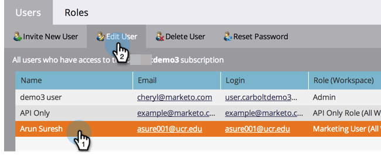

# Gestire i ruoli utente e le autorizzazioni {#managing-user-roles-and-permissions}

Imposta, crea e modifica i ruoli utente e assegnali agli utenti. Questo consente di controllare le aree e le funzionalità a cui ogni utente di Marketo ha accesso.

Ad esempio, un utente marketing in genere ha bisogno di un ampio accesso in tutta l’applicazione per creare, modificare e distribuire e-mail, pagine di destinazione e programmi. Un web designer, invece, trascorre quasi tutto il suo tempo in Design Studio, creando risorse da utilizzare nelle e-mail e nelle pagine di destinazione. Inoltre, anche se i leader aziendali fanno ampio uso dei rapporti di Marketo nell’area di Analytics, potrebbero non dover creare o gestire direttamente le risorse o i programmi.

>[!NOTE]
>
>**Autorizzazioni amministratore richieste**

Marketo fornisce diversi ruoli incorporati, con diversi livelli di accesso:

* **Amministratore** - Tutte le parti dell&#39;applicazione, inclusa la sezione Amministratore
* **Utente standard** - tutte le parti dell&#39;applicazione, ad eccezione della sezione Admin
* **Utente marketing** - tutte le parti dell&#39;applicazione, tranne la sezione Amministratore
* **Web Designer** - solo Design Studio
* **Utente Analytics** - solo la sezione Analytics

Non puoi modificare i ruoli Amministratore e Utente standard, ma puoi modificare gli altri. Puoi anche creare nuovi ruoli personalizzati che corrispondano alle specifiche strutture organizzative della tua azienda.

## Marketo con Identity Service {#marketo-with-adobe-identity}

Se utilizzi Marketo con Adobe Identity, l&#39;elenco delle descrizioni del profilo [si trova qui](/help/marketo/product-docs/administration/marketo-with-adobe-identity/adobe-identity-management-overview.md#profile-levels).

## Assegnare ruoli a un utente {#assign-roles-to-a-user}

Puoi assegnare ruoli a un utente quando [crei utenti per la prima volta](/help/marketo/product-docs/administration/users-and-roles/create-delete-edit-and-change-a-user-role.md) o [modificando un utente esistente](/help/marketo/product-docs/administration/users-and-roles/managing-marketo-users.md).

1. Passa alla schermata **[!UICONTROL Admin]**.

   

1. Fai clic su **[!UICONTROL Users & Roles]**.

   

1. Selezionare l&#39;utente che si desidera modificare dall&#39;elenco e fare clic su **[!UICONTROL Edit User]**.

   

1. In **[!UICONTROL Roles]**, selezionare i ruoli che si desidera assegnare all&#39;utente in base alle autorizzazioni necessarie e fare clic su **[!UICONTROL Save]**.

   

   >[!NOTE]
   >
   >Per informazioni su ciascun ruolo, vedere [Descrizioni delle autorizzazioni per il ruolo](/help/marketo/product-docs/administration/users-and-roles/descriptions-of-role-permissions.md).

## Crea un nuovo ruolo {#create-a-new-role}

Talvolta all’interno dell’organizzazione sono presenti dipendenti con ruoli molto specifici che richiedono una combinazione personalizzata di autorizzazioni.

1. Passa alla schermata **[!UICONTROL Admin]**.

   

1. Fai clic su **[!UICONTROL Users & Roles]**.

   

1. Fare clic sulla scheda **[!UICONTROL Roles]**.

   

1. Fai clic su **[!UICONTROL New Role]**.

   

1. Immettere un **[!UICONTROL Role Name]**, un **[!UICONTROL Description]** (facoltativo) e selezionare le autorizzazioni necessarie per gli utenti con questo ruolo.

   

## Modifica un Ruolo {#edit-a-role}

Se è necessario modificare le autorizzazioni associate a un ruolo esistente, è possibile modificare il ruolo.

1. Passa alla schermata **[!UICONTROL Admin]**.

   

1. Fai clic su **[!UICONTROL Users & Roles]**.

   

1. Fare clic sulla scheda **[!UICONTROL Roles]**.

   

1. Dall&#39;elenco selezionare il ruolo che si desidera modificare e fare clic su **[!UICONTROL Edit Role]**.

   

1. Modificare **[!UICONTROL Role Name]** e **[!UICONTROL Description]** se necessario, modificare la selezione di **[!UICONTROL Permissions]** associati e al termine fare clic su **[!UICONTROL Save]**.

   

   >[!NOTE]
   >
   >Gli utenti che dispongono del ruolo modificato riceveranno le autorizzazioni modificate dopo aver eseguito nuovamente l&#39;accesso e la disconnessione.

## Eliminare un ruolo {#delete-a-role}

Se un ruolo non è più necessario, è possibile eliminarlo.

1. Passa alla schermata **[!UICONTROL Admin]**.

   

1. Fai clic su **[!UICONTROL Users & Roles]**.

   

1. Fare clic sulla scheda **[!UICONTROL Roles]**.

   

1. Dall&#39;elenco, selezionare il ruolo che si desidera eliminare e fare clic su **[!UICONTROL Delete Role]**.

   

1. Fai clic su **[!UICONTROL Delete]** per confermare.

   
