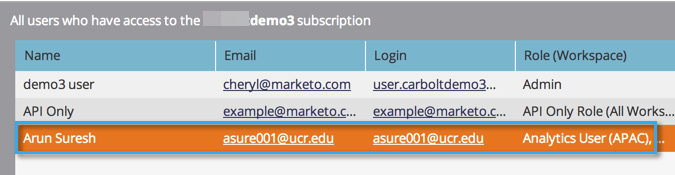

# Consentire l’accesso utente a un’area di lavoro {#allow-user-access-to-a-workspace}

Le aree di lavoro possono avere qualsiasi motivo (ad esempio, separazione geografica o di business unit). Separano le risorse (elenchi avanzati, programmi, ecc.) di ciascun team. Di seguito viene illustrato come concedere a un utente l’accesso a una o più aree di lavoro.

>[!NOTE]
>
>**Autorizzazioni amministratore richieste**

>[!NOTE]
>
>Ulteriori informazioni sulle [aree di lavoro](/help/marketo/product-docs/administration/workspaces-and-person-partitions/understanding-workspaces-and-person-partitions.md).

1. Passa alla schermata **[!UICONTROL Admin]**.

   

1. Fai clic su **[!UICONTROL Users & Roles]**.

   

1. Nella scheda **[!UICONTROL Users]**, selezionare l&#39;utente e fare clic su **[!UICONTROL Edit User]**.

   

1. Selezionare **[!UICONTROL Roles and Workspaces]** a cui si desidera che l&#39;utente abbia accesso.

   

   >[!NOTE]
   >
   >Puoi consentire agli utenti di accedere alle aree di lavoro in qualsiasi combinazione.

Dopo aver salvato le modifiche, dovresti visualizzare l’aggiornamento.

