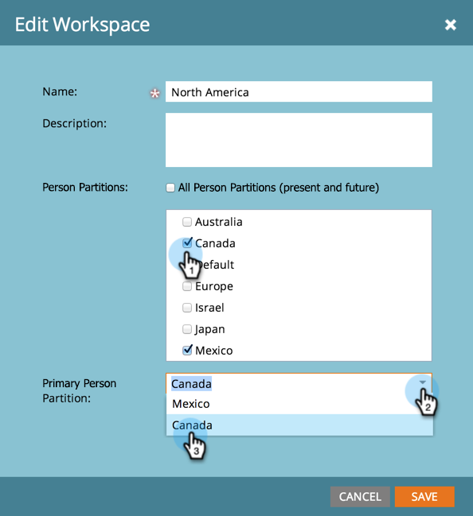

# Assegnare partizioni persone alle aree di lavoro {#assign-person-partitions-to-workspaces}

Di seguito viene illustrato come modificare le assegnazioni della partizione persona/area di lavoro:

>[!NOTE]
>
>**Autorizzazioni amministratore richieste**

>[!PREREQUISITES]
>
>[Crea un nuovo Workspace](/help/marketo/product-docs/administration/workspaces-and-person-partitions/create-a-new-workspace.md){target="_blank"}

>[!CAUTION]
>
>Le aree di lavoro e le partizioni delle persone possono essere complesse. Contatta il [supporto Marketo](https://nation.marketo.com/t5/Support/ct-p/Support){target="_blank"} per assistenza nella configurazione.

1. Passa alla schermata **[!UICONTROL Admin]**.

   

1. Fai clic su **[!UICONTROL Workspaces & Partitions]**.

   

1. Selezionare l'area di lavoro e fare clic su **[!UICONTROL Edit Workspace]**.

   

1. Modificare le informazioni sulla partizione della persona che si desidera modificare.

   

   >[!NOTE]
   >
   >* La casella di controllo "[!UICONTROL All Person Partitions]" indica che l'area di lavoro ha accesso a tutte le partizioni persona nel sistema.
   >
   >* Le partizioni di persona primarie sono quelle predefinite in cui vengono immesse tutte le persone. Utilizza [passaggi di flusso](/help/marketo/product-docs/core-marketo-concepts/smart-campaigns/flow-actions/use-add-choice-in-a-flow-step.md) o [regole di assegnazione](/help/marketo/product-docs/administration/workspaces-and-person-partitions/assigning-person-partitions-with-assignment-rules.md){target="_blank"} per spostare le persone.

1. Fai clic su **[!UICONTROL Save]**.

   

Dopo il salvataggio, dovresti vedere le modifiche.

L'area di lavoro è stata modificata.

>[!MORELIKETHIS]
>
>[Informazioni sulle aree di lavoro e sulle partizioni delle persone](/help/marketo/product-docs/administration/workspaces-and-person-partitions/understanding-workspaces-and-person-partitions.md){target="_blank"}.
