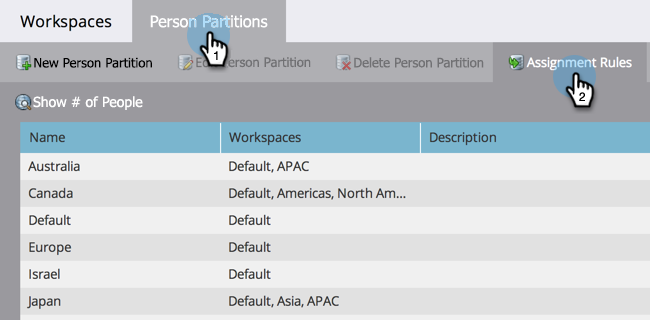

# Assegnazione di partizioni persona con regole di assegnazione {#assigning-person-partitions-with-assignment-rules}

>[!NOTE]
>
>**Autorizzazioni amministratore richieste**

>[!PREREQUISITES]
>
>[Creare una partizione persona](/help/marketo/product-docs/administration/workspaces-and-person-partitions/create-a-person-partition.md)

Quando si utilizzano le partizioni persona, impostare le regole di assegnazione per indirizzare le persone create dal CRM alle rispettive partizioni.

>[!NOTE]
>
>Solo le persone create in Marketo dal CRM e tramite l’API SOAP avranno regole di assegnazione applicate.

1. Vai a **Amministratore** area.

   

1. Clic **Aree di lavoro e partizioni**.

   

1. Sotto **Partizioni persone** , fare clic su **Regole di assegnazione**.

   

1. Clic **Aggiungi scelta** per aggiungere le condizioni per instradare le persone nelle partizioni personali.

   

1. Seleziona il campo su cui deve essere basata la condizione.

   

1. Scegliere l&#39;operatore di scelta e immettere un valore.

   

1. Selezionare la partizione persone in cui si desidera inserire le persone che soddisfano le condizioni.

   

   >[!NOTE]
   >
   >Puoi aggiungere tutte le scelte che ti piacciono.

1. Clic **Salva**.

   

Ed eccola qui! Hai assegnato regole per riempire le partizioni delle persone con le persone.

>[!NOTE]
>
>Se non viene soddisfatta nessuna delle condizioni precedenti, verrà applicata la scelta predefinita.
