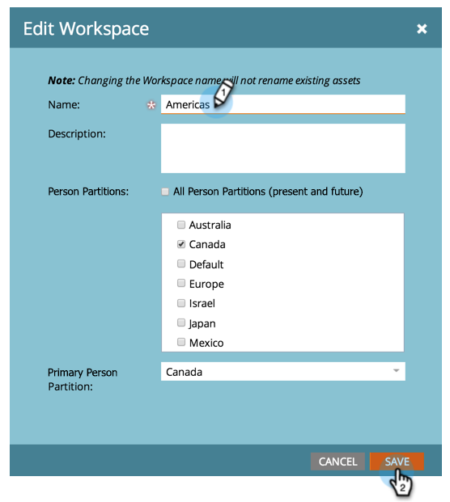

# Modificare il nome di un’area di lavoro {#change-the-name-of-a-workspace}

>[!NOTE]
>
>**Autorizzazioni amministratore richieste**

>[!PREREQUISITES]
>
>[Creare una nuova area di lavoro](/help/marketo/product-docs/administration/workspaces-and-person-partitions/create-a-new-workspace.md)

Gli utenti possono modificare il nome di un’area di lavoro. È piuttosto semplice.

>[!NOTE]
>
>Comprendere prima con [Informazioni sulle aree di lavoro e sulle partizioni delle persone](/help/marketo/product-docs/administration/workspaces-and-person-partitions/understanding-workspaces-and-person-partitions.md).

1. Vai a **[!UICONTROL Amministratore]** area.

   

1. Clic **[!UICONTROL Aree di lavoro e partizioni]**.

   

1. Seleziona l’area di lavoro e fai clic su **[!UICONTROL Modifica area di lavoro]**.

   

1. Inserisci un nuovo **[!UICONTROL Nome]** per il tuo Workspace e fai clic su **[!UICONTROL Salva]**.

   

Dopo il salvataggio, dovresti vedere le modifiche.

