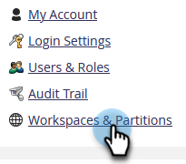

# Creare una partizione persona {#create-a-person-partition}

Creare una nuova partizione persona seguendo la procedura riportata di seguito.

>[!NOTE]
>
>**Autorizzazioni amministratore richieste**

>[!NOTE]
>
>Comprendere prima con [Informazioni sulle aree di lavoro e sulle partizioni delle persone](/help/marketo/product-docs/administration/workspaces-and-person-partitions/understanding-workspaces-and-person-partitions.md).

1. Vai a **[!UICONTROL Amministratore]** area.

   

1. Clic **[!UICONTROL Aree di lavoro e partizioni]**.

   

1. Vai a **[!UICONTROL Partizioni della persona]** e fai clic su **[!UICONTROL Nuova partizione persona]**.

   

1. Assegnare un nome alla partizione, scegliere **[!UICONTROL Aree di lavoro]** nel punto in cui verrà visualizzato e fare clic su **[!UICONTROL Crea]**.

   

Dopo aver creato la partizione, dovrebbe essere visualizzato l’aggiornamento.

