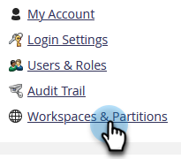

# Eliminare un’area di lavoro {#delete-a-workspace}

>[!NOTE]
>
>**Autorizzazioni amministratore richieste**

>[!NOTE]
>
>Impossibile eliminare l&#39;area di lavoro predefinita in Marketo.

1. Passa alla schermata **[!UICONTROL Admin]**.

   

1. Fai clic su **[!UICONTROL Workspaces & Partitions]**.

   

1. Selezionare un&#39;area di lavoro e fare clic su **[!UICONTROL Delete Workspace]**.

   

1. Conferma il numero di risorse che stai per eliminare (sono elencate accanto a &quot;[!UICONTROL total assets]&quot;), seleziona la casella di controllo **[!UICONTROL Cannot Undo]**, quindi fai clic su **[!UICONTROL Delete]**.

   
