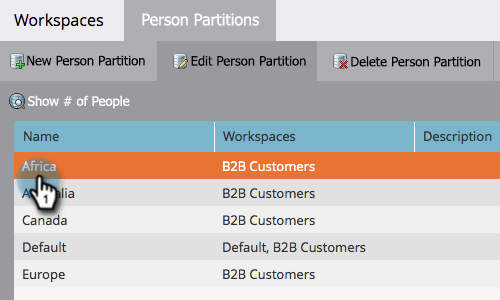

# Modificare una partizione di persona esistente {#edit-an-existing-person-partition}

Una partizione di persona è simile a un secondo (o terzo) database. È possibile collegare una partizione a una o più aree di lavoro. Per modificare i dettagli della partizione, procedere come segue.

>[!NOTE]
>
>**Autorizzazioni amministratore richieste**

>[!PREREQUISITES]
>
>[Creare una partizione di persona](/help/marketo/product-docs/administration/workspaces-and-person-partitions/create-a-person-partition.md){target="_blank"}

1. Passare all&#39;area **[!UICONTROL Admin]**.

   

1. Fai clic su **[!UICONTROL Workspaces & Partitions]**.

   

1. Nella scheda **[!UICONTROL Person Partitions]** selezionare la partizione persona che si desidera modificare e fare clic su **[!UICONTROL Edit Person Partition]**.

   

1. Immettere la partizione persona **[!UICONTROL Name]**, il **[!UICONTROL Workspaces]** a cui appartengono e fare clic su **[!UICONTROL Save]**.

   

Dopo aver salvato le modifiche, dovresti visualizzare l’aggiornamento.

