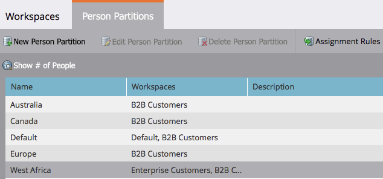

# Modificare una partizione di persona esistente {#edit-an-existing-person-partition}

Una partizione di persona è simile a un secondo (o terzo) database. È possibile collegare una partizione a una o più aree di lavoro. Per modificare i dettagli della partizione, procedere come segue.

>[!NOTE]
>
>**Autorizzazioni amministratore richieste**

>[!PREREQUISITES]
>
>[Creare una partizione persona](/help/marketo/product-docs/administration/workspaces-and-person-partitions/create-a-person-partition.md){target="_blank"}

1. Vai a **[!UICONTROL Amministratore]** area.

   

1. Clic **[!UICONTROL Aree di lavoro e partizioni]**.

   

1. Sotto **[!UICONTROL Partizioni della persona]** , selezionare la partizione persona da modificare e fare clic su **[!UICONTROL Modifica partizione persona]**.

   

1. Inserisci la partizione persona **[!UICONTROL Nome]**, il **[!UICONTROL Aree di lavoro]** appartengono a e fai clic su **[!UICONTROL Salva]**.

   

Dopo aver salvato le modifiche, dovresti visualizzare l’aggiornamento.

