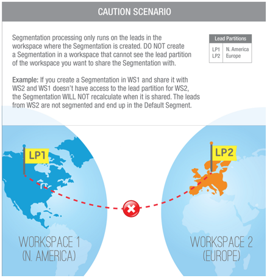

# Condividere segmentazioni tra aree di lavoro e partizioni {#share-segmentations-across-workspaces-and-partitions}

>[!PREREQUISITES]
>
>Questo articolo è destinato solo ai clienti che dispongono di aree di lavoro e partizioni.

## Cos’è una segmentazione? {#whats-a-segmentation}

Marketo è in grado di individuare le persone giuste per un programma o una campagna intelligente. Tuttavia, per gli utenti tipo più permanenti, devi utilizzare le segmentazioni. Sono necessarie per utilizzare contenuti dinamici avanzati in Marketo.

>[!NOTE]
>
>Scopri [come creare segmentazioni](/help/marketo/product-docs/personalization/segmentation-and-snippets/segmentation/create-a-segmentation.md).

Dopo aver configurato questi utenti tipo (_e_ si utilizzano le aree di lavoro), è necessario condividerle tra le aree di lavoro. Ecco alcune cose buone da sapere:

## Regole e suggerimenti {#rules-tips}

* Ogni abbonamento a Marketo può contenere fino a 20 segmentazioni &quot;totali&quot; in più aree di lavoro (**non 20 per workspace**).
* Puoi condividere una segmentazione solo con le aree di lavoro a cui hai accesso.
* Assicurati di creare e utilizzare un’ **Area di lavoro predefinita con visibilità in tutte le partizioni**.

* L’elaborazione della segmentazione viene eseguita solo sulle persone nell’area di lavoro in cui viene creata la segmentazione.

   * Crea la segmentazione da condividere nell’area di lavoro predefinita.
      * Approvare la segmentazione
      * L’area di lavoro condivisa visualizza una cartella bloccata e la segmentazione è di sola lettura.
      * Impossibile modificare la versione condivisa. Puoi modificare solo la segmentazione originale nel punto in cui è stata creata.
   * Quando fai clic su un segmento (ad esempio, settore sanitario) all’interno di una segmentazione condivisa, le persone visualizzate saranno solo quelle nella partizione associata all’area di lavoro che stai visualizzando.
      * Se si crea una segmentazione in Workspace 1 (WS1) e la si condivide con WS2 e WS1 non dispone dell&#39;accesso alla partizione per WS2, LA segmentazione NON VERRÀ ricalcolata.
      * Se crei una segmentazione in un’area di lavoro con partizioni limitate e la condividi con un’altra area di lavoro, l’area di lavoro che ha ricevuto la segmentazione condivisa vedrà le persone solo se si sovrappongono.

>[!NOTE]
>
>Alcune di queste regole sono un po&#39; complesse. Il modo più semplice per iniziare è quello di testare con persone specifiche. Puoi sempre effettuare nuove segmentazioni ed eliminare quelle vecchie.

## Scenari di esempio {#example-scenarios}

## Condividere una segmentazione {#share-a-segmentation}

1. Vai a **Database**.

   

1. Clic con il pulsante destro **Segmentazioni** e seleziona **Nuove cartelle**.

   

1. Assegna un nome alla cartella da condividere tra le aree di lavoro (ad esempio: Condividi segmentazioni).

   

1. Sposta le segmentazioni da condividere nella cartella.

   

1. Fare clic con il pulsante destro del mouse sulla cartella e selezionare **Condividi cartella**.

   

1. Seleziona i workspace con cui vuoi condividere la cartella. Clic **Salva**.

   

   >[!NOTE]
   >
   >La finestra di dialogo mostra le aree di lavoro per le quali disponi dell’autorizzazione di visualizzazione. Per questo motivo, Marketo consiglia di creare e condividere segmentazioni dall’area di lavoro predefinita che abbiano visibilità in tutte le aree di lavoro e le partizioni.

La cartella di origine viene visualizzata nella struttura del database con una freccia che indica che è condivisa con altre aree di lavoro. Dall’interno dell’area di lavoro condivisa, la cartella viene visualizzata con un lucchetto per indicare che il contenuto della cartella è stato condiviso da un’altra area di lavoro e che è di sola lettura.
