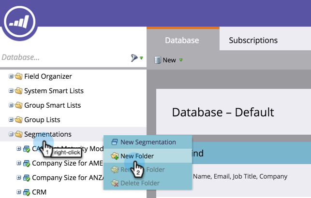

# Informazioni su aree di lavoro e partizioni di persone {#understanding-workspaces-and-person-partitions}

## Aree di lavoro {#workspaces}

>[!CAUTION]
>
>Le aree di lavoro possono essere complesse da configurare. Contatto [Supporto Marketo](https://nation.marketo.com/t5/Support/ct-p/Support) per scoprire se hanno ragione per te.

Le aree di lavoro sono aree separate in Marketo che contengono risorse di marketing come programmi, pagine di destinazione, e-mail e altro ancora. Possono essere utilizzati da più persone. Ogni utente ha accesso a una o più aree di lavoro.

>[!NOTE]
>
>**Esempio**
>
>Per alcuni motivi è possibile utilizzare un’area di lavoro:
>
>* Informazioni geografiche: I reparti marketing Europa, Asia e Nord America ricevono uno spazio di lavoro
>* Business Unit: Quicken, Quickbook e TurboTax ciascuno ottengono un&#39;area di lavoro
>
>In ogni caso, la separazione è dovuta al fatto che le risorse di marketing sono completamente diverse. Se condividono risorse di marketing, le aree di lavoro potrebbero non essere lo strumento giusto per te.

>[!NOTE]
>
>Scopri come creare [creare una nuova area di lavoro](/help/marketo/product-docs/administration/workspaces-and-person-partitions/create-a-new-workspace.md).

## Condivisione tra aree di lavoro {#sharing-across-workspaces}

Ecco come condividere risorse tra le aree di lavoro. Funziona allo stesso modo per tutto ciò che vuoi condividere; questo esempio mostra le segmentazioni.

>[!NOTE]
>
>La cartella principale contenente le risorse è l’unica cartella che può essere condivisa, non le cartelle secondarie.

1. Crea una nuova cartella.

   

1. Denomina la cartella che condividi.

   

1. Sposta le risorse da condividere nella cartella.

   

1. Fai clic con il pulsante destro del mouse sulla cartella e seleziona **Condividi cartella**.

   

1. Seleziona le aree di lavoro con cui desideri condividere la cartella e fai clic su **Salva**. Nella finestra di dialogo Condividi cartella vengono visualizzate solo le aree di lavoro autorizzate.

   

   >[!NOTE]
   >
   >La cartella di origine ora presenta una freccia verde che indica che è stata condivisa. Nell&#39;area di lavoro condivisa, la cartella avrà un lucchetto che indica la sola lettura.

Puoi condividere questi elementi tra le diverse aree di lavoro.

* Modelli e-mail
* Modelli di pagina di destinazione
* Modelli
* Campagne intelligenti
* [Elenchi smart](/help/marketo/product-docs/core-marketo-concepts/smart-lists-and-static-lists/using-smart-lists/reference-a-list-or-smart-list-across-workspaces.md)
* [Segmenti](/help/marketo/product-docs/administration/workspaces-and-person-partitions/share-segmentations-across-workspaces-and-partitions.md)
* Frammenti

## Clonazione tra aree di lavoro {#cloning-across-workspaces}

Per le risorse che non sono modelli, è meglio clonarle come risorse locali all’interno di un programma.  Con il livello di accesso appropriato, puoi trascinare e rilasciare queste risorse in un’altra area di lavoro:

* Programmi
* E-mail
* Pagine di destinazione
* Forms

>[!NOTE]
>
>Quando si clonano risorse con modelli, questi devono essere condivisi con l’area di lavoro di destinazione.

## Spostamento di risorse in altre aree di lavoro {#moving-assets-to-other-workspaces}

Per spostare le risorse in una nuova area di lavoro, inserirle in una cartella e trascinarle nell’altra area di lavoro.

>[!NOTE]
>
>Non è possibile spostare un programma che contiene membri da un&#39;area di lavoro a un&#39;altra.

## Partizioni di persona {#person-partitions}

Le partizioni personali si comportano come database separati. Ogni partizione ha le proprie persone che non deduplicano o si mescolano con altre partizioni. Se ritieni di avere un caso d&#39;uso commerciale che può richiedere la presenza di record duplicati con lo stesso indirizzo e-mail, contatta [Supporto Marketo](https://nation.marketo.com/t5/Support/ct-p/Support).

È possibile assegnare partizioni personali a  [aree di lavoro](create-a-new-workspace.md) nelle seguenti configurazioni:

* un&#39;area di lavoro a una partizione personale (1:1)
* un&#39;area di lavoro per più partizioni di persone (1:x)
* molte aree di lavoro in una partizione personale (x:1)

>[!NOTE]
>
>Motivi per cui si utilizza una partizione personale:
>
>* Le aree di lavoro non dispongono solo di risorse diverse, ma non condividono nemmeno altre persone
>* Desideri duplicare per altri motivi aziendali

>[!CAUTION]
>
>Le partizioni personali non interagiscono tra loro, quindi presta attenzione quando le configura.

>[!NOTE]
>
>Scopri come [creare una partizione personale](/help/marketo/product-docs/administration/workspaces-and-person-partitions/create-a-person-partition.md).
