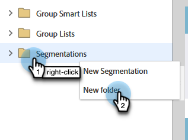
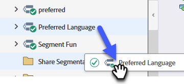
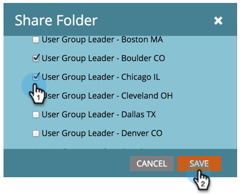

# Informazioni sulle aree di lavoro e sulle partizioni per persone {#understanding-workspaces-and-person-partitions}

## Aree di lavoro {#workspaces}

>[!CAUTION]
>
>La configurazione delle aree di lavoro può essere complessa. Contatta l’[assistenza Marketo](https://nation.marketo.com/t5/support/ct-p/Support) per verificare se fanno al caso tuo.

Le aree di lavoro sono aree separate in Marketo che contengono risorse di marketing come programmi, pagine di destinazione, e-mail e altro ancora. Possono essere utilizzate da più persone. Ogni utente ha accesso a una o più aree di lavoro.

>[!NOTE]
>
>**Esempio**
>
>Alcuni motivi per cui potresti utilizzare un’area di lavoro:
>
>* Suddivisione geografica: per assegnare un’area di lavoro specifica a ciascuno dei reparti marketing per Europa, Asia o Nord America
>* Suddivisione per unità aziendale: per assegnare un’area di lavoro specifica a ciascuna delle divisioni che usa [!DNL Quicken], [!DNL Quickbooks] o [!DNL TurboTax]
>
>In entrambi i casi, la separazione è dovuta al fatto che questi diversi gruppi di utenti usano risorse di marketing completamente diverse. Se invece condividono le stesse risorse di marketing, allo le aree di lavoro potrebbero non essere lo strumento adatto alle tue esigenze.

>[!NOTE]
>
>Scopri come [creare una nuova area di lavoro](/help/marketo/product-docs/administration/workspaces-and-person-partitions/create-a-new-workspace.md).

## Condivisione tra più aree di lavoro {#sharing-across-workspaces}

Ecco come condividere le risorse tra più aree di lavoro. La procedura è uguale per qualsiasi elemento che desideri condividere; per questo esempio, abbiamo utilizzato le segmentazioni.

>[!NOTE]
>
>La cartella principale contenente le risorse è l’unica che può essere condivisa; non è possibile condividerne singole cartelle secondarie.

1. Fai clic su **[!UICONTROL Database]**.

   

1. Fai clic con il pulsante destro sulla cartella Segmentazione e quindi su **[!UICONTROL New Folder]**.

   

1. Assegna un nome alla cartella e fai clic su **[!UICONTROL Create]**.

   

1. Sposta in questa cartella le risorse da condividere.

   

1. Fai clic con il pulsante destro sulla cartella e seleziona **[!UICONTROL Share Folder]**.

   

1. Seleziona le aree di lavoro con cui condividere la cartella e fai clic su **[!UICONTROL Save]**. Nella finestra di dialogo Condividi cartella vengono visualizzate solo le aree di lavoro per le quali disponi delle autorizzazioni di visualizzazione.

   

   >[!NOTE]
   >
   >La cartella di origine presenta ora una piccola freccia verde per indicare che è stata condivisa. Nell’area di lavoro condivisa, la cartella presenta un lucchetto per indicare che è di sola lettura.

Puoi condividere tra più aree di lavoro i seguenti elementi.

* Modelli e-mail
* Modelli per pagine di destinazione
* Modelli
* Campagne avanzate
* [Elenchi avanzati](/help/marketo/product-docs/core-marketo-concepts/smart-lists-and-static-lists/using-smart-lists/reference-a-list-or-smart-list-across-workspaces.md)
* [Segmentazioni](/help/marketo/product-docs/administration/workspaces-and-person-partitions/share-segmentations-across-workspaces-and-partitions.md)
* Snippet

## Clonazione tra aree di lavoro {#cloning-across-workspaces}

Per le risorse che non sono modelli, è preferibile clonarle come risorse locali all’interno di un programma. Se disponi del livello di accesso appropriato, puoi trascinare queste risorse in un’altra area di lavoro:

* Programmi
* E-mail
* Pagine di destinazione
* Moduli

>[!IMPORTANT]
>
>Tutti gli elementi elencati sopra possono essere clonati nelle aree di lavoro; tuttavia, le e-mail, i moduli e le pagine di destinazione _devono trovarsi all’interno di un programma_ al momento della clonazione.

>[!NOTE]
>
>Quando si clonano risorse contenenti dei modelli, questi devono essere condivisi con l’area di lavoro di destinazione.

## Spostare le risorse in altre aree di lavoro {#moving-assets-to-other-workspaces}

Per spostare delle risorse in una nuova area di lavoro, inseriscile in una cartella e trascina tale cartella nella nuova area di lavoro.

>[!NOTE]
>
>Non puoi spostare un programma che contiene membri da un’area di lavoro a un’altra.

## Partizioni per persone {#person-partitions}

Le partizioni per persone si comportano come database separati. Ogni partizione ha le proprie persone che non vengono deduplicate o mescolate con altre partizioni. Se ritieni che un caso d’uso aziendale possa richiedere la duplicazione di record con lo stesso indirizzo e-mail, contatta l’[assistenza Marketo](https://nation.marketo.com/t5/support/ct-p/Support).

Puoi assegnare le partizioni per persone alle [aree di lavoro](create-a-new-workspace.md) nelle seguenti configurazioni:

* un’area di lavoro a una partizione per persone (1:1)
* un’area di lavoro a più partizioni per persone (1:x)
* più aree di lavoro a una partizione per persone (x:1)

>[!NOTE]
>
>Motivi per cui utilizzare una partizione per persone:
>
>* Oltre ad avere risorse diverse, le tue aree di lavoro non devono condividere le stesse persone.
>* Per esigenze di business, devi poter utilizzare duplicati.

>[!CAUTION]
>
>Le partizioni per persone non interagiscono tra loro, quindi fai attenzione quando le configuri.

>[!NOTE]
>
>Scopri come [creare una partizione per persone](/help/marketo/product-docs/administration/workspaces-and-person-partitions/create-a-person-partition.md).
