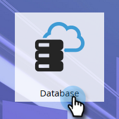
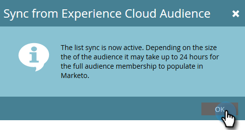

# Sincronizzare un pubblico da Adobe Experience Cloud {#sync-an-audience-from-adobe-experience-cloud}

>[!NOTE]
>
>Una distribuzione compatibile con HIPAA di un’istanza Marketo non può utilizzare questa integrazione.

>[!PREREQUISITES]
>
>[Imposta mappatura organizzazione Adobe](/help/marketo/product-docs/adobe-experience-cloud-integrations/set-up-adobe-organization-mapping.md){target="_blank"}

## Sincronizzare un pubblico {#how-to-sync-an-audience}

1. In Il mio Marketo, fare clic sul riquadro **[!UICONTROL Database]**.

   

1. Fai clic sul menu a discesa **[!UICONTROL New]** e seleziona **[!UICONTROL Sync from Experience Cloud Audience]**.

   

1. Fare clic sul menu a discesa **[!UICONTROL Audience Library Folder]** e selezionare la cartella di origine desiderata.

   

1. Selezionare un **[!UICONTROL Audience Name]**.

   

1. Per la destinazione, puoi selezionare un elenco esistente o digitarne il nome di uno nuovo. In questo esempio viene creato un nuovo elenco. Al termine, fai clic su **[!UICONTROL Sync]**.

   

1. Fai clic su **[!UICONTROL OK]**.

   

## Domande frequenti {#faq}

**Come funziona la sincronizzazione dei cookie?**

Quando la sincronizzazione dei cookie è abilitata per l’abbonamento a Marketo, munchkin.js di Marketo tenta di acquisire e memorizzare gli ECID di Adobe per l’organizzazione IMS di Adobe specificata durante la configurazione dell’integrazione e di far corrispondere questi ECID all’identificatore cookie di Marketo corrispondente. Questo consente ai profili utente anonimi di Marketo di arricchirsi con gli ECID di Adobe.

È necessario un ulteriore passaggio per associare il profilo utente anonimo a un profilo lead, identificato mediante un’e-mail in testo normale. [ è descritto esattamente come funziona](/help/marketo/product-docs/reporting/basic-reporting/report-activity/tracking-anonymous-activity-and-people.md){target="_blank"}.

**Perché la dimensione dell&#39;elenco in Marketo è diversa da quella in Adobe?**

Inoltre, una persona non eseguirà la sincronizzazione se un ID cookie ECID non può essere associato a una persona nota in Marketo.

**È una sincronizzazione occasionale?**

È sufficiente avviare la sincronizzazione una sola volta. In seguito, i record verranno sincronizzati automaticamente. La sincronizzazione iniziale può richiedere fino a 24 ore; in futuro, la sincronizzazione dei nuovi record sarà tra 2 e 3 ore.
