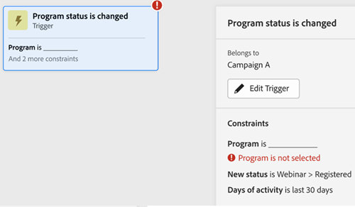

# Scheda Mappa di coinvolgimento {#engagement-map-tab}

Engagement Map è rappresentato tramite una serie di schede di trigger, filtri e flusso. Facendo clic su ogni scheda vengono visualizzate ulteriori informazioni.

Panoramica trigger: questa scheda mostra il numero di trigger nella campagna. Facendo clic su di esso verrà visualizzata una scheda per ogni trigger, nonché un pannello a tendina con le seguenti informazioni:

* Campagna a cui appartiene il trigger
* Elenco dei nomi dei trigger
* Pulsante &quot;Modifica attivatore&quot;

  

Dettagli trigger: questa scheda mostra il nome del trigger. Facendo clic su di esso verrà visualizzato un pannello a tendina con le seguenti informazioni:

* Campagna a cui appartiene il trigger
* Elenco dei vincoli associati al trigger
* Pulsante &quot;Modifica attivatore&quot;

  

Filtro: facendo clic su questa scheda viene visualizzato un pannello a tendina con le seguenti informazioni:

* Campagna a cui appartiene il trigger
* Numero stimato di persone idonee per il filtro
* Elenco dei filtri e dei rispettivi vincoli
* Pulsante &quot;Modifica filtro&quot;

  

Passaggi di flusso: se un passaggio di flusso include scelte, questa scheda mostra il nome del passaggio di flusso. Facendo clic su di esso verrà visualizzato un pannello a tendina con le seguenti informazioni:

* Campagna a cui appartiene il passaggio Flusso
* Elenco delle condizioni di scelta associate alla fase del flusso
* Pulsante &quot;Modifica flusso&quot;

  

Passaggi di flusso: in caso contrario _non_ includi eventuali scelte, questa scheda mostrerà gli attributi associati al passaggio di flusso. Facendo clic su di esso verrà visualizzato un pannello a tendina con le seguenti informazioni:

* Campagna a cui appartiene il passaggio Flusso
* Elenco di attributi associati al passaggio del flusso
* Pulsante &quot;Modifica flusso&quot;

  

## Passaggio di flusso per le campagne Esegui e Richiedi {#flow-step-for-execute-and-request-campaigns}

* Se il passaggio di flusso Esegui o Richiedi campagna non include opzioni, nella scheda viene visualizzato il nome della campagna. Facendo clic sulla scheda viene visualizzato un pannello a tendina con le seguenti informazioni:

   * Campagna a cui appartiene il passaggio di flusso
   * Pulsante &quot;Modifica flusso&quot;
   * Elenco di attributi associati al passaggio del flusso
   * Pulsante &quot;Visualizza elenco&quot;, che apre un elenco di campagne che utilizzano la specifica campagna di richiesta/esecuzione

>[!NOTE]
>
>Puoi modificare i passaggi del flusso da una campagna principale. Per modificare le campagne nidificate, devi passare alla campagna tramite il collegamento presente nel pannello a tendina.

* Se il passaggio di flusso Esegui o Richiedi campagna include delle scelte, la scheda mostra il nome della campagna. Facendo clic sulla scheda viene visualizzato un pannello a tendina con le seguenti informazioni:

   * Campagna a cui appartiene il passaggio di flusso
   * Elenco delle condizioni di scelta associate alla fase del flusso
   * Pulsante &quot;Modifica flusso&quot;

  

  

* Se una campagna Execute (Esegui) o Request (Richiedi) include delle scelte, facendo clic sulla scheda del flusso si espande per mostrare tutte le scelte nelle singole schede. Facendo clic sulla scheda di scelta si espanderà la campagna associata alla scelta specifica e si visualizzerà un pannello a tendina con le seguenti informazioni:

   * Campagna a cui appartiene la scelta
   * Pulsante &quot;Modifica scelta&quot;
   * Elenco delle condizioni di scelta associate alla fase del flusso
   * Pulsante &quot;Visualizza elenco&quot;, che apre un elenco di campagne che utilizzano la specifica campagna di richiesta/esecuzione

  

## Visualizzazione di una campagna di esecuzione nidificata {#visualizing-a-nested-execute-campaign}

È STATA SELEZIONATA LA MODIFICA QUI-------------

Eseguire le campagne eseguite in serie con le persone della campagna padre idonee per una campagna eseguibile completare tutti i passaggi di flusso dalla campagna e tornare alla campagna principale per continuare attraverso i passaggi di flusso di questa campagna.

Di seguito è riportato un esempio di campagna intelligente, &quot;Campaign A&quot;, che include un passaggio di esecuzione del flusso della campagna. Considera &quot;Campagna A&quot; come la tua campagna principale.

1. Facendo clic sulla scheda del flusso di esecuzione della campagna, si espande per visualizzare i dettagli della &quot;Campagna B&quot;.
1. La &quot;Campagna B&quot; include un filtro che si espande in un pubblico qualificato e non qualificato.
1. Il pubblico qualificato attraversa i passaggi di flusso associati alla &quot;Campagna B&quot;.
1. Tutti i tipi di pubblico (qualificati e non qualificati) tornano alla &quot;Campagna A&quot; e passano al passaggio di flusso successivo.

HA SMESSO DI MODIFICARE QUI------------------

Puoi fare clic sul passaggio del flusso Esegui campagna in &quot;Campaign B&quot;, che si espanderà per mostrare le schede di scelta e la campagna associate a ciascuna scelta.

## Visualizzazione di una campagna di richieste {#visualizing-request-campaign}

Le campagne di richiesta vengono eseguite in parallelo con la campagna principale, ovvero i lead idonei per una campagna di richiesta completano tutti i passaggi del flusso dalla campagna e chiudono la campagna. In parallelo, lo stesso set di lead passerà attraverso i passaggi del flusso dalla campagna principale

Di seguito è riportato un esempio di campagna intelligente &quot;Campagna A&quot; che include un passaggio di flusso della campagna di richiesta. Puoi considerare la &quot;Campagna A&quot; come la tua campagna principale.

1. Facendo clic sulla scheda del flusso della campagna di richiesta si espanderà per visualizzare i dettagli della &quot;Campagna B&quot;
1. La campagna B include un filtro che consente di eseguire il branch in un pubblico qualificato.
1. Il pubblico qualificato attraversa i passaggi di flusso associati alla &quot;Campagna B&quot;
1. In parallelo, tutti i tipi di pubblico passano ai passaggi di flusso successivi nella &quot;Campagna A&quot;

   

Puoi approfondire le campagne nidificate, se uno dei passaggi del flusso include un’altra campagna di richiesta, facendo clic sulla scheda del flusso per visualizzare i dettagli della campagna

Di seguito è riportato un esempio di campagna di richieste con scelte.

## Gestione degli errori {#error-handling}

Gli errori nei passaggi dell’elenco smart e del flusso vengono evidenziati tramite l’icona di errore nella scheda. Inoltre, il messaggio di errore corrispondente verrà visualizzato nel pannello a tendina.

Ecco un esempio di errore nel trigger che verrà indicato nella scheda di panoramica del trigger, nel pannello a tendina e nella scheda di attivazione dei dettagli

Errore nella scheda del filtro: può includere

Errore nell’elenco avanzato. Il pubblico qualificato non verrà visualizzato

Errore nella logica del filtro

Errore nei vincoli o mancanza di vincoli in uno o più filtri

Se non si immettono valori (attributi), questi non verranno contrassegnati come errori e continueranno a funzionare come nella scheda Flusso. Pertanto, le campagne esistenti non verranno interrotte. Tuttavia, quando i passaggi di flusso non includono attributi, questi verranno visualizzati come avvisi.

Nota: gli errori all’interno di una campagna nidificata non saranno visibili finché non fai clic su per espandere la campagna nidificata
