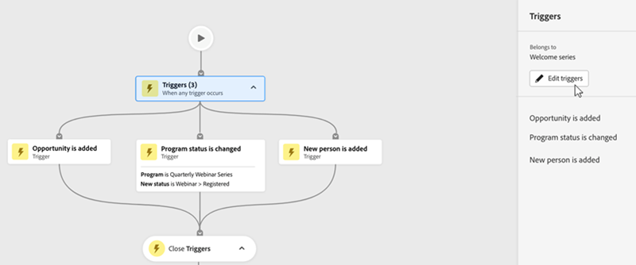

# Scheda Mappa di coinvolgimento {#engagement-map-tab}

Engagement Map è rappresentato tramite una serie di schede di trigger, filtri e flusso. Facendo clic su ogni scheda vengono visualizzate ulteriori informazioni.

Panoramica trigger: questa scheda mostra il numero di trigger nella campagna. Facendo clic su di esso viene visualizzata una scheda per ogni attivatore e un pannello a tendina con le seguenti informazioni:

* Campagna a cui appartiene il trigger
* Elenco dei nomi dei trigger
* Modifica trigger

  

Dettagli trigger: questa scheda mostra il nome del trigger. Facendo clic su di esso viene visualizzato un pannello a tendina con le seguenti informazioni:

* Campagna a cui appartiene il trigger
* Elenco dei vincoli associati al trigger
* Modifica trigger

Filtro: facendo clic su questa scheda viene visualizzato un pannello a tendina con le seguenti informazioni:

* Campagna a cui appartiene il filtro
* Numero stimato di persone idonee per il filtro
* Elenco dei filtri e dei rispettivi vincoli
* Modifica filtro

  

Passaggi di flusso: se un passo di flusso include delle scelte, questa scheda mostra il nome del passo di flusso. Facendo clic su di esso viene visualizzato un pannello a tendina con le seguenti informazioni:

* Campagna a cui appartiene il passaggio di flusso
* Elenco delle condizioni di scelta associate al passaggio del flusso
* Passaggio Modifica flusso

Passaggi di flusso: se un passaggio di flusso _non_ include scelte, questa scheda mostra gli attributi associati al passaggio di flusso. Facendo clic su di esso viene visualizzato un pannello a tendina con le seguenti informazioni:

* Campagna a cui appartiene il passaggio di flusso
* Elenco di attributi associati al passaggio del flusso
* Passaggio Modifica flusso

  

## Passaggio di flusso per le campagne Esegui e Richiedi {#flow-step-for-execute-and-request-campaigns}

* Se il passaggio di flusso Esegui o Richiedi campagna non include alcuna scelta, la scheda mostra il nome della campagna. Facendo clic sulla scheda viene visualizzato un pannello a tendina con le seguenti informazioni:

   * Campagna a cui appartiene il passaggio di flusso
   * Passaggio Modifica flusso
   * Elenco di attributi associati al passaggio del flusso
   * Pulsante &quot;Visualizza elenco&quot;, che apre un elenco di campagne che utilizzano la specifica campagna di richiesta/esecuzione

>[!NOTE]
>
>Puoi modificare i passaggi del flusso da una campagna principale. Per modificare le campagne nidificate, devi passare alla campagna tramite il collegamento presente nel pannello a tendina.

* Se il Passaggio di flusso Esegui o Richiedi campagna include delle scelte, facendo clic sulla scheda viene visualizzato un pannello a tendina con le seguenti informazioni:

   * Campagna a cui appartiene il passaggio di flusso
   * Elenco delle condizioni di scelta associate al passaggio del flusso
   * Passaggio Modifica flusso

* Se una campagna Execute (Esegui) o Request (Richiedi) include delle scelte, facendo clic sulla scheda del flusso si espande per mostrare tutte le scelte nelle singole schede. Facendo clic sulla scheda _scelta_, si espande la campagna associata alla scelta specifica e si visualizza un pannello a tendina con le seguenti informazioni:

   * Campagna a cui appartiene la scelta
   * Modifica scelta
   * Elenco delle condizioni di scelta associate al passaggio del flusso
   * Visualizza elenco, che apre un elenco di campagne che utilizzano la specifica campagna di richiesta/esecuzione

  

## Visualizzazione di una campagna di esecuzione nidificata {#visualizing-a-nested-execute-campaign}

Esegui le campagne eseguite in serie con la campagna principale. Le persone idonee per una campagna eseguibile completano tutti i passaggi del flusso dalla campagna e tornano alla campagna principale per continuare attraverso i passaggi del flusso di questa campagna.

Di seguito è riportato un esempio di campagna avanzata, &quot;Campaign A&quot;, che include un passaggio di esecuzione del flusso della campagna. Considera &quot;Campagna A&quot; come la tua campagna principale.

1. Facendo clic sulla scheda Esegui flusso campagna, vengono visualizzati i dettagli della &quot;Campagna B&quot;.
1. &quot;Campagna B&quot; include un filtro che divide il pubblico in due gruppi: qualificato e non qualificato.
1. Un pubblico qualificato attraversa i passaggi di flusso associati alla &quot;Campagna B&quot;.
1. Tutti i tipi di pubblico (qualificati e non qualificati) tornano alla &quot;Campagna A&quot; e passano alla fase di flusso successiva.

   

Puoi fare clic sul Passaggio Esegui flusso campagna in &quot;Campaign B&quot;, che si espanderà per mostrare le schede di scelta e la campagna associate a ciascuna scelta.

## Visualizzazione di una campagna di richieste {#visualizing-request-campaign}

Le campagne di richiesta vengono eseguite in parallelo alla campagna principale. Le persone idonee per una campagna di richieste completano tutti i passaggi del flusso dalla campagna e quindi escono dalla campagna. Contemporaneamente, lo stesso gruppo di persone passa attraverso i Passaggi del Flusso della campagna principale.

Di seguito è riportato un esempio di campagna avanzata, &quot;Campaign A&quot;, che include un passaggio di flusso della campagna di richieste. Considera &quot;Campagna A&quot; come la tua campagna principale.

1. Facendo clic sulla scheda del flusso della campagna di richiesta si espande per visualizzare i dettagli della &quot;Campagna B&quot;
1. &quot;Campagna B&quot; include un filtro che divide il pubblico in due gruppi: qualificato e non qualificato.
1. Il pubblico qualificato attraversa i passaggi di flusso associati alla &quot;Campagna B&quot;.
1. Allo stesso tempo, tutti i tipi di pubblico passano ai passaggi di flusso successivi nella &quot;Campagna A&quot;.

   

Puoi approfondire le campagne nidificate se uno dei passaggi del flusso include un’altra campagna di richiesta facendo clic sulla scheda del flusso per visualizzare i dettagli della campagna.

Di seguito è riportato un esempio di campagna di richiesta con scelte.

## Gestione degli errori {#error-handling}

Gli errori negli elenchi avanzati e nei passaggi del flusso vengono evidenziati da un’icona rossa nella scheda. Inoltre, nel pannello a tendina viene visualizzato un messaggio di errore corrispondente.

Gli avvisi negli elenchi avanzati e nei passaggi del flusso vengono evidenziati da un’icona arancione nella scheda. Inoltre, nel pannello a tendina viene visualizzato un messaggio di avvertenza corrispondente.

Di seguito è riportato un esempio di avviso in una scheda Scelta che viene visualizzata nella scheda del passaggio Esegui campagna, nel pannello a tendina e nella scheda Scelta predefinita.

>[!NOTE]
>
>Gli avvisi sono consigli da rivedere, ma non sono indicativi di errori in Smart Campaign.

**Gli errori nelle schede dei filtri possono includere:**

* Errore nell’elenco avanzato che impedirà la visualizzazione di un pubblico qualificato

* Errore nella logica del filtro

* Errore o assenza di vincoli in uno o più filtri

  

>[!NOTE]
>
>Gli errori all’interno di una campagna nidificata non saranno visibili finché non fai clic su per espandere la campagna nidificata.
