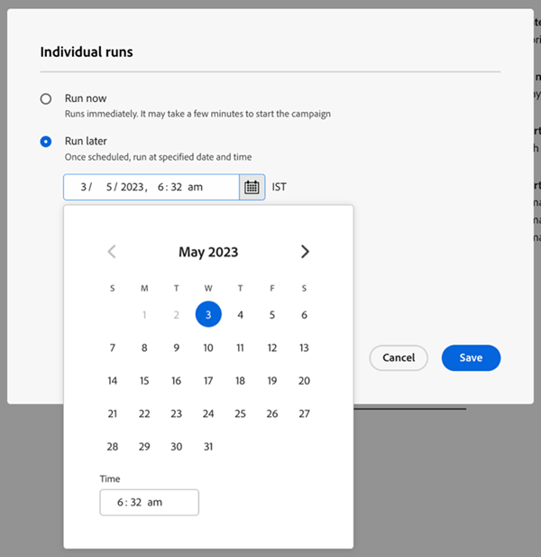

# Scheda Impostazioni {#settings-tab}

La scheda Impostazioni contiene tutte le impostazioni della campagna, inclusi gli stessi set di autorizzazioni e l’accesso della scheda Pianificazione in Smart Campaigns.

Include le tre sezioni seguenti.

* **Regole di qualificazione**: determina quante volte ogni persona può eseguire il flusso di Smart Campaign.

* **Singole esecuzioni**: può essere utilizzato per pianificare esecuzioni singole immediatamente o in futuro.

* **Ricorrenza**: utilizzato per pianificare una ricorrenza giornaliera, settimanale o mensile.

  

Le regole di qualifica saranno disponibili per tutte le campagne (trigger e batch) e includono le seguenti impostazioni:

* Puoi determinare quante volte una persona passa attraverso una campagna
* Possibilità di bloccare una campagna non operativa se la persona ha superato il limite di comunicazione
* Possibilità di impostare un limite di persone per la campagna di interruzione

  

È possibile utilizzare singole esecuzioni per eseguire immediatamente una campagna o per impostare esecuzioni una tantum in futuro.

>[!TIP]
>
>Se pianifichi una serie di campagne, è più facile utilizzare la finestra modale di ricorrenza.

La modalità di ricorrenza include la possibilità di impostare una pianificazione ricorrente su base giornaliera, settimanale o mensile. Una volta effettuata la configurazione, potrai vedere le prossime tre esecuzioni nella scheda Impostazioni.

La scheda Impostazioni include anche una rapida panoramica di Smart Campaign. Include quanto segue:

* Stato della campagna
* Creato il
* Ultima modifica
* Modalità elenco avanzato
* Stato elenco avanzato:
   * Persone stimate che saranno interessate
   * Persone stimate bloccate dalle e-mail
   * Persone stimate in un passaggio di attesa

Set di autorizzazioni ed errori nella scheda Impostazioni:

Tutti i set di autorizzazioni esistenti saranno applicabili nella scheda Impostazioni. Se il pulsante Modifica è disattivato, fai clic sull’icona Aiuto per scoprirne il motivo.

>[!NOTE]
>
>Se dopo aver fatto clic sull’icona della guida viene visualizzato &quot;È necessaria un’autorizzazione aggiuntiva&quot;, contatta il tuo amministratore Marketo.

