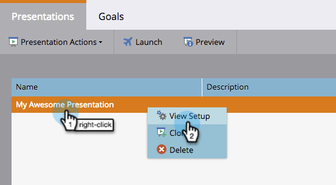
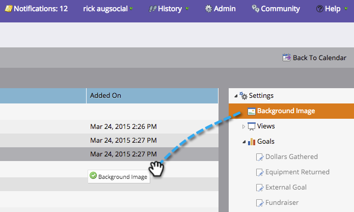

# Aggiungere un’immagine di sfondo a una presentazione {#add-a-background-image-to-a-presentation}

Personalizzare una presentazione selezionando un&#39;immagine di sfondo.

>[!PREREQUISITES]
>
>[Crea una presentazione](/help/marketo/product-docs/core-marketo-concepts/marketing-calendar/calendar-hd/create-a-presentation.md)

1. Fare clic con il pulsante destro del mouse su una presentazione e selezionare **[!UICONTROL View Setup]**.

   >[!NOTE]
   >
   >È inoltre possibile fare doppio clic su una presentazione per accedere alla scheda di impostazione.

   

1. Trascina **[!UICONTROL Background Image]** dalla struttura destra all&#39;area di lavoro.

   

1. Seleziona un&#39;immagine dalla libreria di immagini.

   >[!TIP]
   >
   >Per un aspetto più pulito, utilizzare un&#39;immagine **1920 x 1080** o **1280 x 720**.

   

1. Fare clic su **[!UICONTROL Preview]** per visualizzarne l&#39;anteprima.

   

