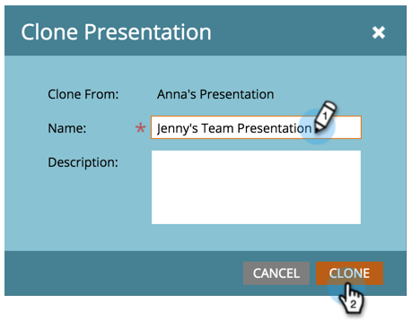

# Clonare una presentazione {#clone-a-presentation}

Clonare una presentazione per riutilizzarla in posizioni diverse.

1. Selezionare la presentazione da clonare.

   

1. Fare clic con il pulsante destro del mouse sulla presentazione e selezionare **[!UICONTROL Clone]**.

   

1. Immettere un nome per la presentazione clonata e fare clic su **[!UICONTROL Clone]**.

   

   È ora disponibile una copia esatta della presentazione.
