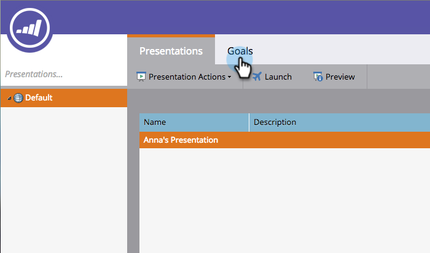
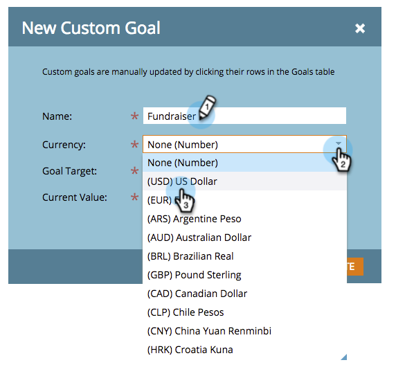
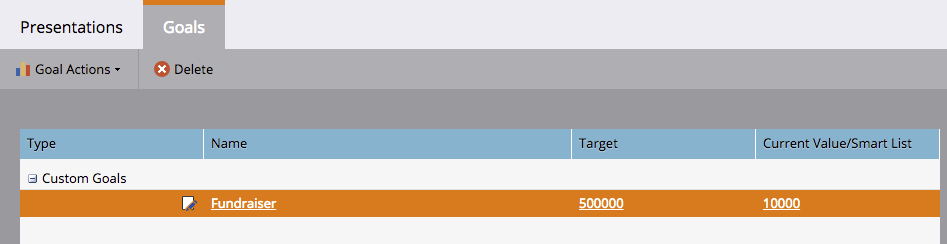

# Creare un obiettivo personalizzato {#create-a-custom-goal}

Gli obiettivi sono modi per tenere traccia dei progressi e motivare il tuo team. Una volta creati, devono essere aggiornati manualmente.

Analogamente alle presentazioni, gli obiettivi sono specifici di [workspace](/help/marketo/product-docs/administration/workspaces-and-person-partitions/understanding-workspaces-and-person-partitions.md).

1. Passare a **[!UICONTROL Calendar]**.

   

1. Fai clic su **[!UICONTROL Presentations]** nell&#39;angolo in basso a destra.

   

1. Seleziona la scheda **[!UICONTROL Goals]**.

   

1. Trascina **[!UICONTROL Custom Goal]** nell&#39;area di lavoro.

   

1. Immetti un nome per l’obiettivo. Seleziona **[!UICONTROL Currency]**.

   >[!NOTE]
   >
   >Se l&#39;obiettivo non è un valore monetario, è possibile selezionare **[!UICONTROL None]**.

   

1. Immettere un valore per **[!UICONTROL Goal Target]** e **[!UICONTROL Current Value]** (se non esiste, immettere **0**). Quindi fai clic su **[!UICONTROL Create]**.

   

   L&#39;obiettivo personalizzato è stato creato.

   
