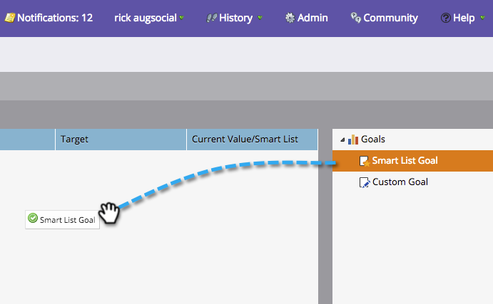

# Creare un obiettivo di elenco avanzato {#create-a-smart-list-goal}

Gli obiettivi sono modi per tenere traccia dei progressi e motivare il tuo team. Possono essere combinati con elenchi avanzati per monitorare tutti i tipi di cose in Marketo. Inoltre, dopo aver impostato un obiettivo di elenco avanzato, questo viene aggiornato automaticamente ogni 2 ore quando viene utilizzato in una presentazione.

Come le presentazioni, gli obiettivi sono [workspace](/help/marketo/product-docs/administration/workspaces-and-person-partitions/understanding-workspaces-and-person-partitions.md)specifico di.

1. Vai a **[!UICONTROL Calendario]**.

   

1. Clic **[!UICONTROL Presentations]** nell’angolo in basso a destra.

   

1. Seleziona la **[!UICONTROL Obiettivi]** scheda.

   

1. Trascina **[!UICONTROL Obiettivo elenco avanzato]** nell’area di lavoro.

   

1. Immetti un nome per l’obiettivo e una **[!UICONTROL Target obiettivo]**. Quindi fai clic su **[!UICONTROL Crea]**.

   

1. [Definire l’elenco avanzato](/help/marketo/product-docs/core-marketo-concepts/smart-lists-and-static-lists/creating-a-smart-list/find-and-add-filters-to-a-smart-list.md). Le possibilità sono infinite!

   

1. Una volta impostato l’elenco avanzato, fai clic su **[!UICONTROL Chiudi]** e tornare alla scheda precedente.

   

   Guardate quello! L&#39;obiettivo dell&#39;elenco avanzato è stato creato.

   
