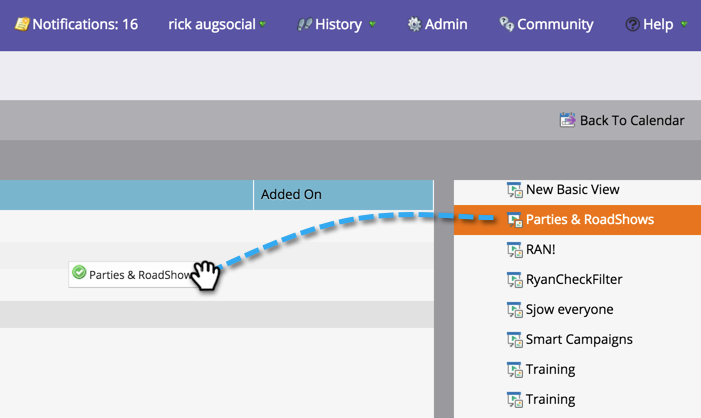
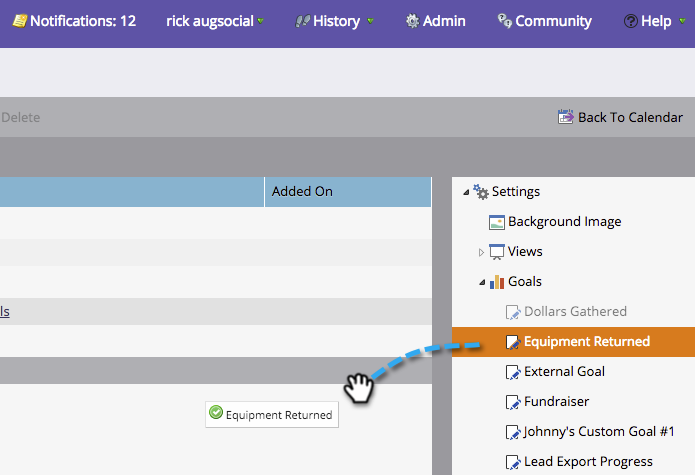
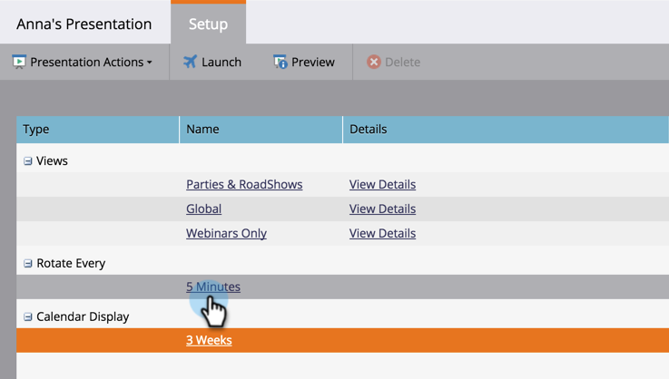
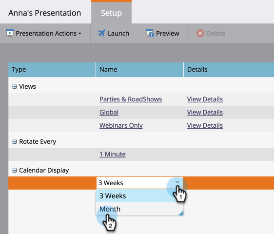

# Personalizzare una presentazione {#customize-a-presentation}

Imposta la presentazione del calendario in modo che rifletta gli obiettivi e le attività più importanti per il tuo team.

>[!AVAILABILITY]
>
>
>Non tutti gli utenti di Marketo Engage hanno acquistato questa funzionalità. Per informazioni, contatta il team dell’account di Adobe (il tuo Account Manager).

>[!PREREQUISITES]
>
>* [Crea obiettivi personalizzati](/help/marketo/product-docs/core-marketo-concepts/marketing-calendar/calendar-hd/create-a-custom-goal.md){target="_blank"} o [Obiettivi elenco avanzato](/help/marketo/product-docs/core-marketo-concepts/marketing-calendar/calendar-hd/create-a-smart-list-goal.md){target="_blank"}
>
>* [Crea una presentazione](/help/marketo/product-docs/core-marketo-concepts/marketing-calendar/calendar-hd/create-a-presentation.md){target="_blank"}

## Scelta delle viste {#choosing-the-views}

Le presentazioni passano attraverso diverse [definizioni di filtro](/help/marketo/product-docs/core-marketo-concepts/marketing-calendar/working-with-the-calendar/filtering-the-marketing-calendar.md){target="_blank"} scelte. Richiama tutte le visualizzazioni che desideri e personalizza la frequenza.

1. Dall&#39;albero destro trascinare le diverse viste da ruotare nella presentazione.

   

## Aggiungi un obiettivo {#add-a-goal}

Le presentazioni sono più efficaci quando mostrano gli obiettivi del team. Trascina su diversi [obiettivi personalizzati](/help/marketo/product-docs/core-marketo-concepts/marketing-calendar/calendar-hd/create-a-custom-goal.md){target="_blank"} o [obiettivi elenco avanzato](/help/marketo/product-docs/core-marketo-concepts/marketing-calendar/calendar-hd/create-a-smart-list-goal.md){target="_blank"}. È possibile utilizzare fino a 10.

1. Nell&#39;albero a destra trascinare i diversi obiettivi che si desidera visualizzare nella presentazione.

   

## Impostare la frequenza di rotazione {#set-the-frequency-of-rotation}

Una volta inserite le viste, impostate la frequenza di rotazione tra le diverse viste.

1. Fare clic su **[!UICONTROL 5 minutes]** (cadenza predefinita).

   

1. Immetti un orario in minuti. Fai clic su **[!UICONTROL Save]**.

   >[!NOTE]
   >
   >Visualizzare una visualizzazione statica selezionando **[!UICONTROL Disable Rotation]**.

   

## Impostare la visualizzazione del calendario {#set-the-calendar-display}

È possibile impostare la visualizzazione del calendario su 3 settimane o mensile.

1. Selezionare l&#39;elenco a discesa **[!UICONTROL Calendar Display]** e scegliere tra **[!UICONTROL 3 weeks]** o uno **[!UICONTROL Month]**.

   

>[!TIP]
>
>Imposta [immagine di sfondo](/help/marketo/product-docs/core-marketo-concepts/marketing-calendar/calendar-hd/add-a-background-image-to-a-presentation.md){target="_blank"} per la presentazione.

## Anteprima di una presentazione {#preview-a-presentation}

Una volta configurata, la presentazione è pronta per essere visualizzata in anteprima e avviata.

1. Seleziona **[!UICONTROL Preview]**.

   

   Ecco come potrebbe apparire la presentazione.

   

   Per regolare la visualizzazione, utilizza definizioni di filtro diverse.

>[!MORELIKETHIS]
>
>* [Aggiungere un&#39;immagine di sfondo a una presentazione](/help/marketo/product-docs/core-marketo-concepts/marketing-calendar/calendar-hd/add-a-background-image-to-a-presentation.md){target="_blank"}
>* [Avvia una presentazione](/help/marketo/product-docs/core-marketo-concepts/marketing-calendar/calendar-hd/launch-a-presentation.md){target="_blank"}
