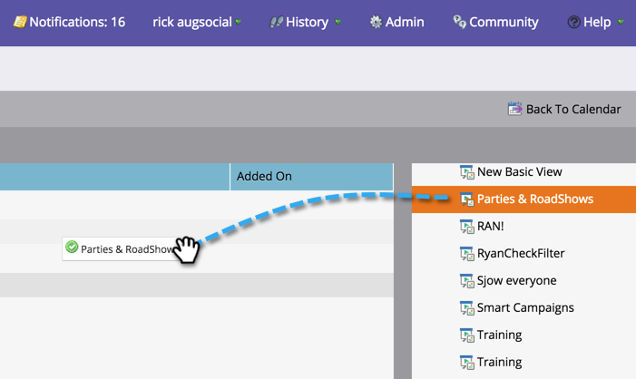

# Personalizzare una presentazione {#customize-a-presentation}

Imposta la presentazione del calendario in modo che rifletta gli obiettivi e le attività più importanti per il tuo team.

>[!AVAILABILITY]
>
>
>Non tutti i clienti hanno acquistato questa funzionalità. Contatta il tuo rappresentante commerciale per i dettagli.

>[!PREREQUISITES]
>
>* [Creare obiettivi ](/help/marketo/product-docs/core-marketo-concepts/marketing-calendar/calendar-hd/create-a-custom-goal.md) di elenco  [avanzati personalizzati goalor](/help/marketo/product-docs/core-marketo-concepts/marketing-calendar/calendar-hd/create-a-smart-list-goal.md)
   >
   >
* [Creare una presentazione](/help/marketo/product-docs/core-marketo-concepts/marketing-calendar/calendar-hd/create-a-presentation.md)

## Scelta delle visualizzazioni {#choosing-the-views}

Presentations passa attraverso diverse [definizioni di filtro](/help/marketo/product-docs/core-marketo-concepts/marketing-calendar/working-with-the-calendar/filtering-the-marketing-calendar.md) scelte. Inserire tutte le visualizzazioni desiderate e personalizzare la frequenza.

1. Dall’albero di destra, trascinate le diverse viste da ruotare nella presentazione.

   

## Aggiungi un obiettivo {#add-a-goal}

Presentations è la più straordinaria quando visualizzano gli obiettivi del tuo team. Trascina i diversi [obiettivi personalizzati](/help/marketo/product-docs/core-marketo-concepts/marketing-calendar/calendar-hd/create-a-custom-goal.md) o [obiettivi dell’elenco smart](/help/marketo/product-docs/core-marketo-concepts/marketing-calendar/calendar-hd/create-a-smart-list-goal.md). Puoi utilizzare fino a 10.

1. Dall’albero di destra, trascina i diversi obiettivi da visualizzare nella presentazione.

   

## Impostare la frequenza di rotazione {#set-the-frequency-of-rotation}

Dopo aver inserito le visualizzazioni desiderate nella presentazione, impostate la frequenza di rotazione tra le diverse viste.

1. Fare clic su **5 minuti** (cadenza predefinita).

   

1. Immettere un&#39;ora utilizzando i minuti. Fare clic su **Salva**.

   >[!NOTE]
   >
   >Visualizzare una visualizzazione statica selezionando **Disattiva rotazione**.

   

## Imposta la visualizzazione del calendario {#set-the-calendar-display}

La visualizzazione del calendario può essere modificata in una visualizzazione a 3 settimane o mensile.

1. Seleziona il menu a discesa **Visualizzazione calendario** e scegli tra **3 settimane** o uno **Mese**.

   

   Fantastico! Pronti a vedere la tua presentazione?

>[!TIP]
>
>Imposta un [immagine di sfondo](/help/marketo/product-docs/core-marketo-concepts/marketing-calendar/calendar-hd/add-a-background-image-to-a-presentation.md) per la presentazione. Suggeriamo gattini o arcobaleni.

## Anteprima di una presentazione {#preview-a-presentation}

Una volta configurata, la presentazione è pronta per essere visualizzata in anteprima e avviata.

1. Selezionare **Anteprima**.

   

   Ta-da! Questo è l&#39;aspetto della presentazione.

   

   Non ti piace quello che vedi? Torna indietro e utilizza definizioni di filtro diverse per creare la visualizzazione desiderata.

>[!MORELIKETHIS]
>
>* [Aggiungere un’immagine di sfondo a una presentazione](/help/marketo/product-docs/core-marketo-concepts/marketing-calendar/calendar-hd/add-a-background-image-to-a-presentation.md)
>* [Avvia una presentazione](/help/marketo/product-docs/core-marketo-concepts/marketing-calendar/calendar-hd/launch-a-presentation.md)

