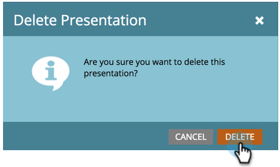

# Eliminare una presentazione {#delete-a-presentation}

A volte puoi avere troppe cose buone. Elimina le vecchie presentazioni per liberare spazio per quelle nuove.

1. Selezionare una presentazione.

   

1. Fai clic con il pulsante destro del mouse e seleziona (Copia negli Appunti) **[!UICONTROL Elimina]**.

   

1. Clic **[!UICONTROL Elimina]** per confermare.

   
