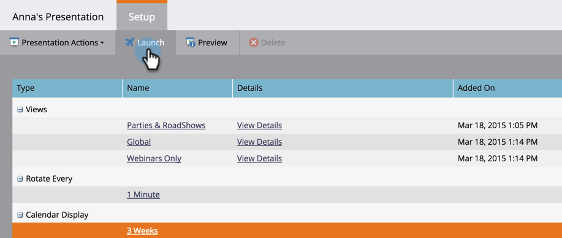

# Avviare una presentazione {#launch-a-presentation}

Una volta impostate le visualizzazioni e la frequenza di rotazione, la presentazione è pronta per l&#39;avvio.

>[!AVAILABILITY]
>
>
>Non tutti gli utenti di Marketo Engage hanno acquistato questa funzionalità. Per informazioni, contatta il team dell’account di Adobe (il tuo Account Manager).

>[!PREREQUISITES]
>
>* [Crea una presentazione](/help/marketo/product-docs/core-marketo-concepts/marketing-calendar/calendar-hd/create-a-presentation.md)
>* [Personalizzare una presentazione](/help/marketo/product-docs/core-marketo-concepts/marketing-calendar/calendar-hd/customize-a-presentation.md)

>[!TIP]
>
>Visualizzare l&#39;anteprima della presentazione prima di avviarla.

1. Fai clic su **[!UICONTROL Launch]**.

   

1. Fai clic su **[!UICONTROL Launch]** un&#39;altra volta. In questo modo si esce da Marketo per poter visualizzare la presentazione in modo sicuro.

   

   >[!TIP]
   >
   >La presentazione verrà avviata in una nuova scheda. Se necessario, spostare la scheda su un monitor esterno per la visualizzazione e fare clic su **[!UICONTROL Fullscreen]**.
