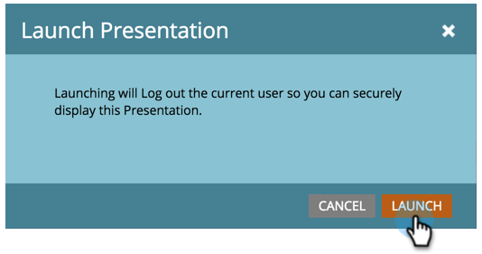

# Avviare una presentazione {#launch-a-presentation}

Dopo aver impostato le visualizzazioni e la frequenza di rotazione per la presentazione, è ora di spegnersi.

>[!AVAILABILITY]
>
>
>Non tutti gli utenti del Marketo Engage hanno acquistato questa funzionalità. Per ulteriori informazioni, contatta l’Adobe Account Team (il tuo Account Manager).

>[!PREREQUISITES]
>
>* [Crea una presentazione](/help/marketo/product-docs/core-marketo-concepts/marketing-calendar/calendar-hd/create-a-presentation.md)
>* [Personalizzare una presentazione](/help/marketo/product-docs/core-marketo-concepts/marketing-calendar/calendar-hd/customize-a-presentation.md)

>[!TIP]
>
>Assicurati di _visualizzare in anteprima una presentazione_ prima di avviare.

1. Fare clic su **[!UICONTROL Avvia]**.

   

1. Fai clic ancora una volta su **[!UICONTROL Avvia]**. In questo modo si esce da Marketo per poter visualizzare la presentazione in modo sicuro.

   

   >[!TIP]
   >
   >La presentazione verrà avviata in una nuova scheda. Se necessario, spostare la scheda su un monitor esterno per la visualizzazione e fare clic su **[!UICONTROL Schermo intero]**.
