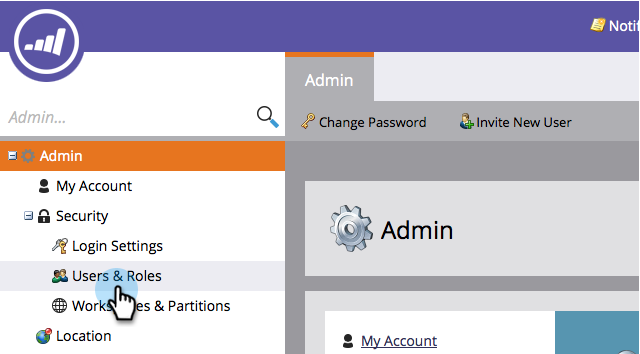
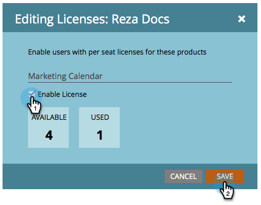
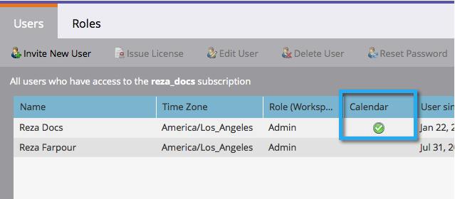

# Rilasciare/revocare una licenza di Marketing Calendar {#issue-revoke-a-marketing-calendar-license}

>[!NOTE]
>
>**Autorizzazioni amministratore richieste**

Per utilizzare [Calendario di marketing](/help/marketo/product-docs/core-marketo-concepts/marketing-calendar/understanding-the-calendar/navigating-the-marketing-calendar.md){target="_blank"} postazioni, devi rilasciare le licenze agli utenti che hanno bisogno di accedervi. Ecco come.

1. Vai a **[!UICONTROL Amministratore]** sezione.

   

1. Clic **[!UICONTROL Utenti e ruoli]**.

   

1. Seleziona gli utenti e fai clic su **[!UICONTROL Licenza Issue]**.

   >[!TIP]
   >
   >Utilizzare **Ctrl/Comando+clic** per selezionare più utenti contemporaneamente.

   

1. Verifica **[!UICONTROL Abilita licenza]** e fai clic su **[!UICONTROL Salva]**.

   >[!NOTE]
   >
   >È previsto un limite di 5 licenze. Per maggiori informazioni, contatta il tuo rappresentante commerciale.

   

   Ben fatto! Vedi il segno di spunta verde in &quot;Calendario?&quot;

   
