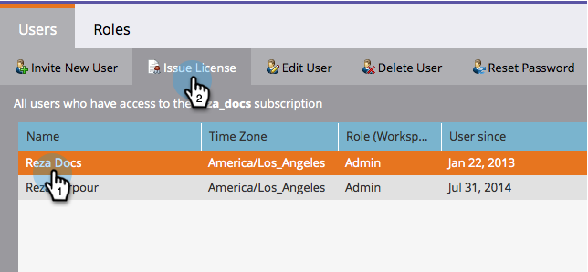

# Rilasciare o revocare una licenza di Marketing Calendar {#issue-revoke-a-marketing-calendar-license}

>[!NOTE]
>
>**Autorizzazioni amministratore richieste**

Per utilizzare le postazioni del [Calendario marketing](/help/marketo/product-docs/core-marketo-concepts/marketing-calendar/understanding-the-calendar/navigating-the-marketing-calendar.md){target="_blank"}, è necessario rilasciare le licenze agli utenti che necessitano di accedervi.

1. Passare alla sezione **[!UICONTROL Admin]**.

   

1. Fai clic su **[!UICONTROL Users & Roles]**.

   

1. Selezionare gli utenti e fare clic su **[!UICONTROL Issue License]**.

   >[!TIP]
   >
   >Utilizza **Ctrl/Comando+clic** per selezionare più utenti contemporaneamente.

   

1. Selezionare **[!UICONTROL Enable License]** e fare clic su **[!UICONTROL Save]**.

   >[!NOTE]
   >
   >È previsto un limite di 5 licenze. Per maggiori informazioni, contatta il tuo rappresentante commerciale.

   

   Il segno di spunta verde dovrebbe ora essere visualizzato in &#39;[!UICONTROL Calendar]&#39;.

   
