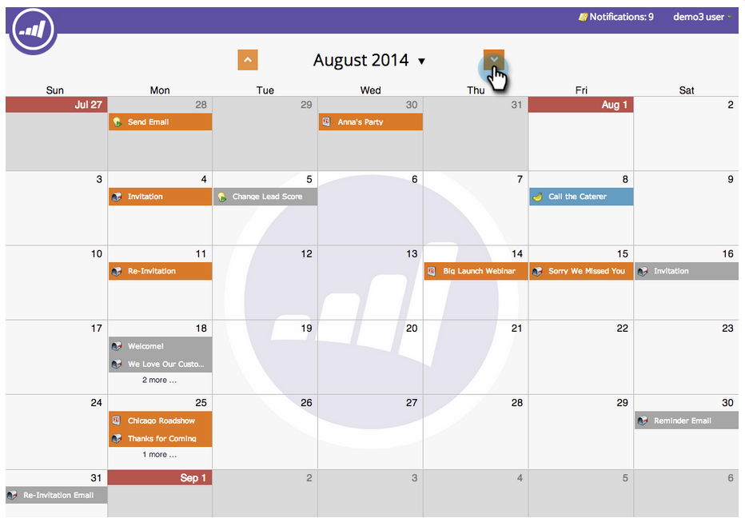

# Navigazione nel calendario marketing {#navigating-the-marketing-calendar}

Scopri come navigare nel calendario di marketing.

>[!PREREQUISITES]
>
>Assicurati di disporre di una [licenza Marketing Calendar](/help/marketo/product-docs/core-marketo-concepts/marketing-calendar/understanding-the-calendar/issue-revoke-a-marketing-calendar-license.md){target="_blank"}, altrimenti la sezione Marketing Calendar (Calendario di marketing) non verrà visualizzata in My Marketo.

>[!NOTE]
>
>Le campagne Smart ricorrenti non sono supportate nel calendario di marketing.

1. Vai al **Calendario di marketing**.

   

1. Questa è una visualizzazione panoramica delle risorse pianificate nell’istanza Marketo.

   

## Cambia tra modalità {#change-between-modes}

1. Fare clic sulle schede **[!UICONTROL 3 weeks]** o **[!UICONTROL Month]** per passare da una modalità all&#39;altra.

   

## Utilizzare la visualizzazione Agenda {#use-the-agenda-view}

Nella vista Agenda tutte le voci vengono visualizzate come elenco.

1. Fare clic sul menu a discesa **[!UICONTROL Filter]**.

   

1. Selezionare la visualizzazione **[!UICONTROL Agenda]**.

   

   Questa visualizzazione mostra tutto ciò che è pianificato.

   

## Naviga nel tempo {#navigate-through-time}

Fare clic sui pulsanti di spostamento.

È inoltre possibile utilizzare queste scelte rapide da tastiera.

| Azione | Scelta rapida da tastiera |
|---|---|
| Indietro | Alt/Opzione + Su |
| Avanti nel tempo | Alt/Opt + Giù |
| Vai a &quot;oggi&quot; | Alt/Opt + T |

Queste sono le basi. È inoltre possibile personalizzare la visualizzazione utilizzando i filtri.

>[!MORELIKETHIS]
>
>[Filtraggio del calendario di marketing](/help/marketo/product-docs/core-marketo-concepts/marketing-calendar/working-with-the-calendar/filtering-the-marketing-calendar.md){target="_blank"}
