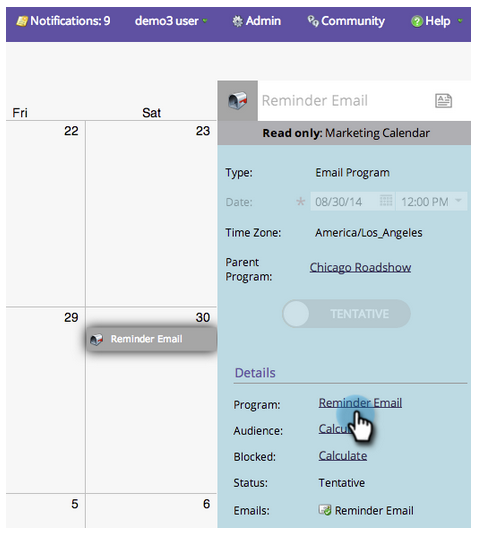

# Visualizza dettagli voce {#view-entry-details}

Quando visualizzi i dettagli della voce nel calendario di marketing, puoi vedere tutta una serie di elementi interessanti relativi a una voce.

1. Seleziona una voce dal calendario.

   

1. Le voci sono di sola lettura nel calendario di marketing. Passa al programma per apportare modifiche.

   

>[!TIP]
>
>Prova a fare clic con il pulsante destro del mouse sui dettagli a destra. Potete vedere i menu per navigare o visualizzare gli editor. Bello, vero?
