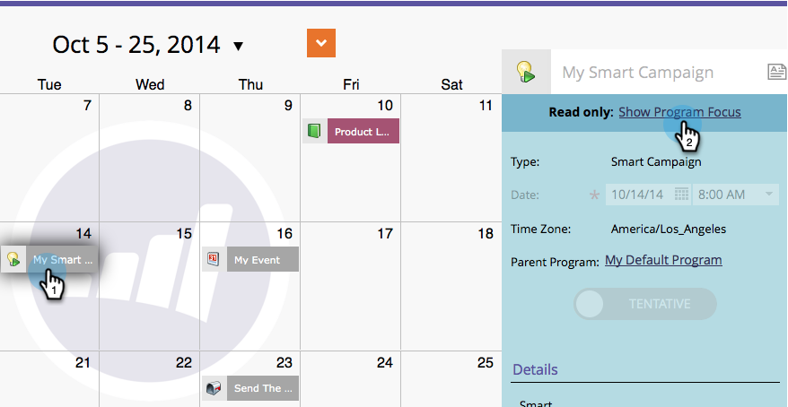

# Confermare le voci direttamente nel calendario marketing {#confirm-entries-directly-in-the-marketing-calendar}

Campagne intelligenti e programmi e-mail possono essere creati come voci provvisorie e devono essere confermati affinché tutto accada effettivamente. Ecco come.

1. Passare a **[!UICONTROL Calendar]**.

   

1. Selezionare la voce da confermare e fare clic su **[!UICONTROL Show Program Focus]**.

   

1. Procedi e conferma la voce.

   

   La conferma esegue una serie di processi di convalida e, se tutto viene sottoposto a Check-Out, la voce viene confermata.

   
