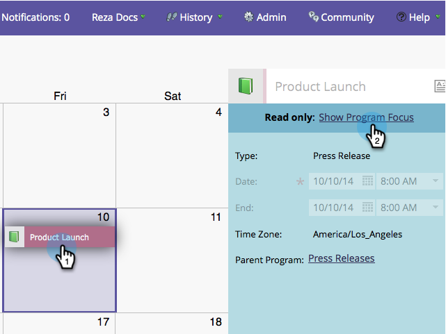

# Creare le voci direttamente nel calendario marketing {#create-entries-directly-in-the-marketing-calendar}

Marketo consente di creare voci direttamente nel calendario di marketing utilizzando la modalità di attivazione del programma. È possibile creare i seguenti tipi di voce:

* Voci di base
* Voci personalizzate
* Programmi e-mail
* Campagne avanzate

1. Fare clic sul riquadro **[!UICONTROL Calendar]**.

   

1. Selezionare una voce precedente e fare clic su **[!UICONTROL Show Program Focus]**.

   

1. Una volta attivata la modalità di attivazione del programma, selezionare il giorno desiderato per aggiungere una voce.

   

1. Assegna un nome alla voce e seleziona un tipo.

   

   >[!TIP]
   >
   >Si noti che è anche possibile creare **Campagne avanzate**, **Programmi e-mail** e **Voci di base** nello stesso modo.

1. Al termine della modifica, chiudi la modalità di attivazione del programma.

   

>[!MORELIKETHIS]
>
>[Modifica le voci direttamente nel calendario di marketing](/help/marketo/product-docs/core-marketo-concepts/marketing-calendar/working-with-the-calendar/edit-entries-directly-in-the-marketing-calendar.md){target="_blank"}
