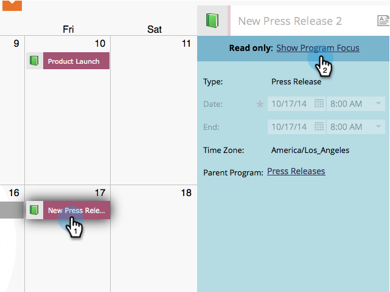

# Eliminare le voci direttamente nel calendario marketing {#delete-entries-directly-in-the-marketing-calendar}

Oltre a [creare](/help/marketo/product-docs/core-marketo-concepts/marketing-calendar/working-with-the-calendar/create-entries-directly-in-the-marketing-calendar.md){target="_blank"} e [modificare](/help/marketo/product-docs/core-marketo-concepts/marketing-calendar/working-with-the-calendar/edit-entries-directly-in-the-marketing-calendar.md){target="_blank"} voci, puoi eliminarle direttamente nel calendario di marketing. Ecco come.

1. Fare clic sul riquadro **MU**.

   

1. Selezionare la voce da eliminare e fare clic su **[!UICONTROL Show Program Focus]**.

   

1. Fai clic sull’icona cestino.

   

A seconda della voce, potrebbe essere necessario confermare l’eliminazione. Ma è tutto!

>[!MORELIKETHIS]
>
>[Conferma le voci direttamente nel calendario di marketing](/help/marketo/product-docs/core-marketo-concepts/marketing-calendar/working-with-the-calendar/confirm-entries-directly-in-the-marketing-calendar.md){target="_blank"}
