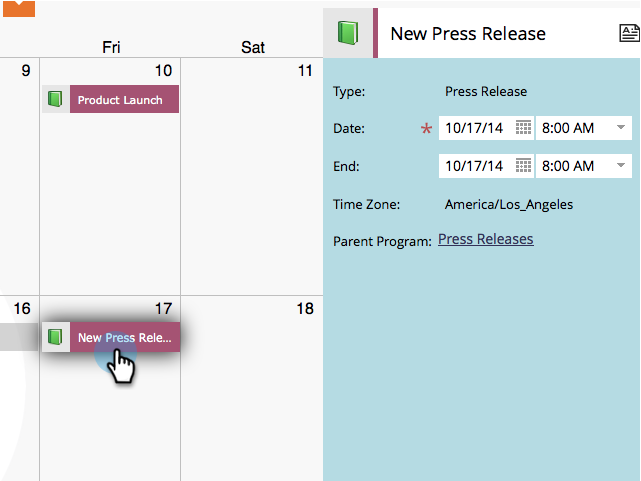

# Modificare le voci direttamente nel calendario di marketing {#edit-entries-directly-in-the-marketing-calendar}

Una volta attivata la modalità di attivazione del programma, è possibile apportare rapidamente modifiche alle voci del calendario. Ecco come.

## Abilita attivazione programma {#enable-program-focus}

1. Fai clic su **[!UICONTROL Calendario]** affiancare.

   

1. Seleziona una voce che appartiene al programma su cui desideri concentrarti e fai clic su **[!UICONTROL Mostra Focus Programma]**.

   

## Riprogramma voce {#reschedule-entry}

1. È sufficiente trascinare una voce per riprogrammarla.

   

## Modifica nome voce {#edit-entry-name}

1. Selezionare la voce da rinominare.

   

1. Modificare il nome della voce.

   

   >[!TIP]
   >
   >Puoi anche modificare la descrizione.
   >
   >

## Converti tipo di voce {#convert-entry-type}

Dopo aver creato rapidamente le voci di base, è possibile convertirle nella forma finale.

1. Individuare e selezionare la voce di base da convertire e modificarne il tipo.

   

## Modifica dettagli voce {#edit-entry-details}

Puoi accedere rapidamente a diverse aree delle voci per la modifica.

1. Fare clic con il pulsante destro del mouse su una voce e selezionare l&#39;area da modificare.

   

Tutto qui! Come puoi vedere ci sono molte cose che puoi fare direttamente dal calendario di marketing.

>[!MORELIKETHIS]
>
>[Elimina voci direttamente nel calendario di marketing](/help/marketo/product-docs/core-marketo-concepts/marketing-calendar/working-with-the-calendar/delete-entries-directly-in-the-marketing-calendar.md){target="_blank"}
