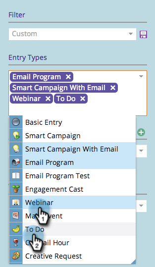
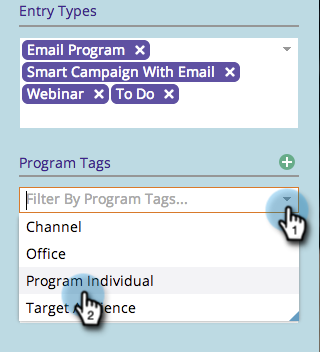

# Filtro del calendario di marketing {#filtering-the-marketing-calendar}

Utilizzare i tipi di voce, i tag di programma o le aree di lavoro per filtrare le informazioni visualizzate nel calendario.

1. Vai al Calendario.

1. Fai clic sull&#39;elenco a discesa **Tipo di voce** .

   >[!NOTE]
   >
   >I tipi di voce predefiniti saranno **E-mail** **Programmi** e **Smart** **Campagne** **con** **E-mail**.

   

1. Scegli i tipi di voce aggiuntivi da visualizzare nel filtro.

   

   >[!TIP]
   >
   >Per la descrizione dei tipi di immissione standard, controllare [Tipi di immissione visualizzazione pianificazione programma](/help/marketo/product-docs/core-marketo-concepts/programs/program-schedule-view/program-schedule-view-entry-types.md).

1. Selezionare i tag di programma di interesse.

   

1. Seleziona il valore del tag.

   

   Fantastico! Verranno visualizzate solo le voci che si applicano al filtro appena definito.

   >[!NOTE]
   >
   >[Salvataggio di una definizione di filtro nel calendario di marketing](/help/marketo/product-docs/core-marketo-concepts/marketing-calendar/working-with-the-calendar/saving-a-filter-definition-in-the-marketing-calendar.md)
