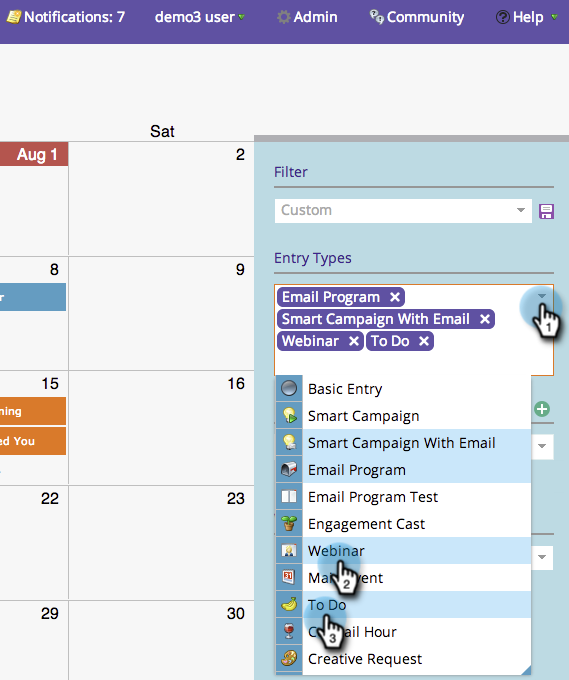
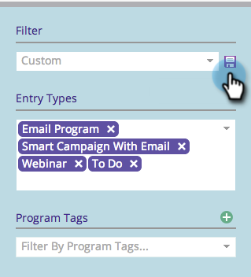

# Salvare una definizione di filtro nel calendario marketing {#saving-a-filter-definition-in-the-marketing-calendar}

Il salvataggio di un filtro consente di passare da una definizione di filtro all’altra.

>[!PREREQUISITES]
>
>[Filtraggio del calendario di marketing](/help/marketo/product-docs/core-marketo-concepts/marketing-calendar/working-with-the-calendar/filtering-the-marketing-calendar.md){target="_blank"}

1. Definisci il filtro.

   

1. Fai clic sull’icona Salva.

   

1. Denomina il filtro. Fai clic su **[!UICONTROL Save]**.

   

   Il filtro è ora salvato.

   

   Se lo desideri, puoi [inviare una copia](/help/marketo/product-docs/core-marketo-concepts/marketing-calendar/working-with-the-calendar/sharing-a-filter-definition-in-the-marketing-calendar.md){target="_blank"} della definizione ad altri utenti di Marketo.

   >[!NOTE]
   >
   >[Condivisione di una definizione di filtro nel calendario di marketing](/help/marketo/product-docs/core-marketo-concepts/marketing-calendar/working-with-the-calendar/sharing-a-filter-definition-in-the-marketing-calendar.md){target="_blank"}
