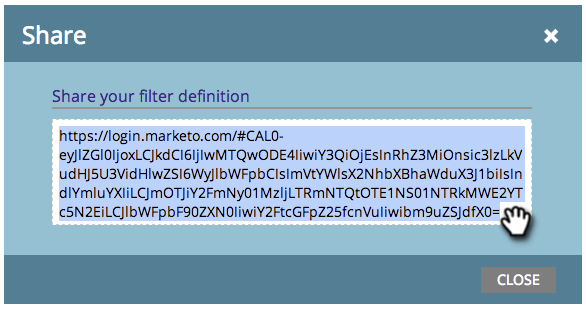

# Condivisione di una definizione di filtro nel calendario di marketing {#sharing-a-filter-definition-in-the-marketing-calendar}

I filtri possono essere condivisi tra utenti diversi.

>[!PREREQUISITES]
>
>* [Creare un filtro nel calendario di marketing](/help/marketo/product-docs/core-marketo-concepts/marketing-calendar/working-with-the-calendar/filtering-the-marketing-calendar.md)
>* [Salvataggio di una definizione di filtro nel calendario di marketing](/help/marketo/product-docs/core-marketo-concepts/marketing-calendar/working-with-the-calendar/saving-a-filter-definition-in-the-marketing-calendar.md)

>[!NOTE]
>
> Se apporti una modifica a un filtro salvato, assicurati di condividerlo nuovamente; le modifiche apportate non verranno applicate ad altri utenti finché non lo farai.

1. Seleziona il filtro da condividere.

   

1. Fai clic sull’icona di condivisione nell’angolo in basso a destra.

   

1. Copia l’URL e condividetelo con altri utenti Marketo.

   

   >[!NOTE]
   >
   >Le autorizzazioni utente influiranno sulla visibilità.
