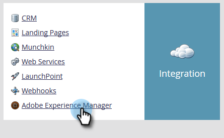

# Configurazione dell&#39;integrazione di Adobe Experience Manager {#configuring-adobe-experience-manager-integration}

Configura AEM per accedere, selezionare e importare AEM risorse in Marketo Design Studio.

>[!NOTE]
>
>**Autorizzazioni amministratore richieste**

>[!CAUTION]
>
>Attualmente, questa funzione è supportata solo in Firefox. Non è supportato in Safari e potrebbe non funzionare nell’ultima versione di Chrome (v. 80), a seconda delle impostazioni dei cookie SameSite.

1. Passa a Adobe Experience Manager (l’URL è specifico per la tua azienda).

   

1. Puoi accedere con Adobe o localmente. In questo esempio effettueremo l’accesso localmente.

   

1. In **Strumenti**, fai clic su **Operazioni** e seleziona **Console web**.

   

1. Nel browser, cerca (ctrl+f su Windows, cmd+f su Mac) &quot;Adobe Granite Cross-Origin Resource Sharing Policy&quot;.

   

1. Fai clic sul segno **+** a destra.

   

1. Nella casella di testo **Origini consentite (Regexp)**, digitare `https://.*\.marketo\.com` e fare clic su **Salva**.

   

1. Nell&#39;intestazione nella parte superiore della pagina, fai clic su **Console web** e seleziona **Informazioni di sistema**.

   

1. In Informazioni server fare clic sul pulsante **Restart** .

   

1. Fare clic su **OK** per confermare.

   

1. In Marketo Classic, fai clic su **Amministratore**.

   

1. In Integrazione, seleziona **Adobe Experience Manager**.

   

1. Fare clic su **Modifica**.

   

1. Inserisci l&#39;URL AEM e fai clic su **OK**.

   

   Siete pronti! È ora possibile [importare AEM risorse in Design Studio in Marketo Sky](https://experienceleague.adobe.com/docs/marketo/sky/design-studio/importing-assets-with-adobe-experience-manager.html?lang=en#design-studio).
